# Stolen Strata: Quantifying the Anthropogenic Erasure of Kashmir's Karewa Terraces and Its Threat to the Saffron Economy

Sakshi D. Maske

*Independent Geospatial Researcher*

## Abstract

Karewa terraces — elevated, flat-topped remnants of a Pliocene-Pleistocene intermontane lake basin — underlie one of Kashmir's most economically important agricultural systems, the saffron cultivation belt of Pampore. Their loss to unregulated soil mining and unplanned urban expansion is well documented anecdotally but has not previously been quantified through a systematic, multi-decadal, satellite-derived pipeline. This study delineates 201 karewa terraces (3,305.3 ha) across the central Kashmir Valley using a Topographic Position Index and slope-threshold terrain analysis, then tracks their bare-earth land-cover fraction across four time points (1994, 2005, 2015, 2025) using season-matched Landsat and Sentinel-2 composites. Mean bare-earth fraction rose from 1.84% to 8.43% over the study period, with the increase concentrated almost entirely in the final decade; in absolute terms, 190.3 hectares of terrace surface converted to bare earth, 67% of it within just 12.4% of terraces. A saffron-signature index, exploiting the crop's inverted phenology, identifies 14 likely saffron-cultivating terraces, 43% of which lie within 1 km of an already-degraded terrace despite no direct overlap — an encroachment-risk finding rather than a direct-loss one. At official 2024-25 state-level saffron yield and value figures, the saffron terraces within that 1 km risk radius represent an estimated Rs 17.8 crore in annual production value sitting within proximity range of active degradation — 55% of the Rs 32.4 crore this study's detected saffron area is estimated to generate in total. Mann-Whitney U tests confirm degraded terraces sit significantly closer to both road infrastructure (p = 0.0116) and settlement built-up area (p = 0.0001, the strongest effect of any test in this study) than intact terraces, consistent with an accessibility-driven model of unregulated extraction. No statute currently protects karewa land from excavation in Jammu & Kashmir; a private member's bill proposing a dedicated Karewa Protection Authority and mandatory impact assessment remains pending. Threshold-sensitivity sweeps, a resolution-matched robustness check (resampling the 2025 Sentinel-2 composite to the 30 m Landsat pixel size used in earlier years), and effect-size/multiple-comparison corrections across all four statistical tests confirm these results are not artefacts of a single arbitrary cutoff, sensor change, or uncorrected p-value, though the precise magnitude of the post-2015 acceleration is modestly resolution-dependent. Together these results establish karewa degradation as a recent, accelerating, spatially concentrated, infrastructure-linked, and economically consequential phenomenon, occurring in the near-total absence of a legal protection regime, with direct implications for how saffron-sector policy investment should be spatially targeted.

**Keywords**: karewa terraces, Kashmir, saffron, land degradation, remote sensing, multi-temporal change detection, unregulated mining, geomorphology, economic valuation, land-use governance

---

## 1. Introduction

The Kashmir Valley's karewa terraces are a geologically singular landform: flat-topped, loess-capped remnants of an ancient lake basin whose fertile, well-drained soils happen to be exceptionally well suited to *Crocus sativus* — saffron — a Geographical Indication-tagged crop that anchors the livelihoods of thousands of farming households in the Pampore belt. Investigative and grey-literature reporting has, over the past decade, documented a steady conversion of this landform into construction-grade soil, driven by unregulated mining for the brick and construction industries and by unplanned urban and infrastructure expansion. What this reporting has not done is quantify the phenomenon systematically, at scale, across time, using independent satellite evidence.

This study addresses that gap directly. Rather than relying on site-specific observation, it builds a fully scripted geospatial pipeline that delineates karewa terrace boundaries from terrain data alone, tracks their land-cover condition across a 31-year satellite record, and connects the resulting degradation pattern to the things that determine whether it matters: the saffron economy the terraces sustain, valued in rupee terms rather than left as a hectare count; the road and settlement infrastructure that makes their extraction economically viable in the first place; and the regulatory environment currently governing — or, as this study finds, largely failing to govern — that extraction.

## 2. Literature Review

### 2.1 The Geomorphological Origins of the Karewa Landscape

The Karewa Group sediments have been studied since the earliest systematic Quaternary geology of the region, beginning with De Terra and Paterson's (1939) foundational stratigraphic work identifying a lacustrine-to-fluvial infill sequence tied to the tectonic uplift of the Pir Panjal Range. More recent work has refined this picture considerably: Dar and Zeeden (2020) review the loess-palaeosol sequences capping the karewa surface and their value as a Quaternary palaeoclimate archive, while Bhat et al. (2016) document soft-sediment deformation structures within the Karewa formations as evidence of palaeo-seismicity. This body of work establishes the karewa surface not as generic upland terrain but as a geologically distinctive, scientifically valuable record — one whose loss to excavation is a loss of both agricultural capacity and geological archive simultaneously.

### 2.2 A Landform Under Economic Pressure

Journalistic and policy-adjacent sources converge on the same underlying story: karewa land is being consumed faster than it is being protected. Rafi and Syed (2023), reporting for Mongabay India, document that the Qazigund-Baramulla railway project alone drew roughly 90% of its construction material from karewa excavation, alongside brick-kiln expansion in Budgam and continuing projects such as the Semi Ring Road, and quote local farmers directly linking this conversion to declining saffron-growing capacity. Against this backdrop of reported loss, the FAO's Globally Important Agricultural Heritage Systems documentation (FAO GIAHS, 2012) records over 3,200 hectares under saffron cultivation at Pampore, supporting more than 17,000 farming families — while separately, Kashmir's saffron sector has also been reported reaching a 25-year production high in recent seasons (Deccan Herald, 2022), a reminder that degradation and short-term output gains are not mutually exclusive signals and that neither should be read in isolation.

### 2.3 Remote Sensing Approaches to Land Degradation Detection

Terrain-based landform classification in this study follows Weiss's (2001) Topographic Position Index framework, which classifies terrain by comparing each cell's elevation to its local neighborhood mean rather than relying on absolute elevation — a method widely adopted for isolating terrain forms such as ridges, valleys, and, as applied here, flat elevated terrace surfaces. For the land-cover change component, this study draws on an established literature applying vegetation-index-based change detection to mining-driven land degradation specifically; Madasa, Orimoloye, and Ololade (2021) demonstrate that geospatial vegetation indices reliably discriminate mining-disturbed land from surrounding cover in a multi-temporal satellite record, a validation of the bare-earth-fraction approach adopted in this study's own methodology.

### 2.4 Infrastructure, Accessibility, and the Economics of Unregulated Extraction

A substantial and growing literature connects road infrastructure to the economics of unregulated resource extraction. Most recently, Engert et al. (2025) show that road expansion is a leading predictor of future tropical deforestation hotspots, reflecting a general principle that extractive land-use pressure concentrates where the marginal cost of transporting material to market is lowest. This study treats karewa mining as governed by the same logic, testing whether degraded terraces are systematically closer to drivable roads than intact ones. On the governance side, recent reporting on the Rs 400 crore PM Saffron Mission and its stated goal of bringing 2,598 hectares under rejuvenation (Press Post, 2026) establishes that meaningful policy capital is already being directed at this landscape — raising, but not yet answering, the question of whether that capital is spatially aligned with where degradation risk is actually concentrated.

## 3. Data and Methodology

### 3.1 Study Design

This study covers the central Kashmir Valley karewa belt spanning Pampore, Pulwama, and Budgam districts together with the type-locality exposures near Srinagar (Zewan section), selected for containing the highest concentration of saffron-bearing karewas in the valley and for being repeatedly identified in secondary literature as a hotspot of unregulated soil mining. Terrace boundaries are delineated algorithmically rather than manually digitized, and every subsequent analytical layer — degradation status, saffron signature, road proximity — is built on top of that same scripted delineation.

### 3.2 Data Sources

| Variable | Source | Temporal Coverage |
|---|---|---|
| Elevation / terrain | Copernicus DEM GLO-30 | Current |
| Land cover (bare-earth fraction) | Landsat 5/7/8/9; Sentinel-2 | 1994, 2005, 2015, 2025 |
| Saffron signature | Sentinel-2 (NDVI, phenology-based) | 2025 |
| Road network | OpenStreetMap (via `osmnx`) | Current |
| Building footprints | OpenStreetMap (via `osmnx`) | Current |
| Saffron cultivation baseline | FAO GIAHS documentation | 2012 (reference) |
| Saffron yield, area, and production value | J&K Legislative Assembly, Agriculture Production Dept. | 2024-25 |
| Karewa legal-protection status | J&K legislative reporting (private member's bill) | 2025 |

### 3.3 Terrace Delineation

Karewa terrace boundaries were delineated from the DEM using a Topographic Position Index (TPI > 3) combined with a slope threshold (< 8°), isolating terrain that is simultaneously flat-topped and locally elevated relative to its surroundings — the defining terrain signature of a karewa tread versus its bounding scarp. Candidate pixels were vectorized and filtered to polygons ≥ 0.05 km² in area and within the 1,550–2,000 m elevation band known to host karewa exposures, yielding 201 terrace polygons totalling 3,305.3 hectares.

### 3.4 Multi-Temporal Degradation Detection

Land-cover condition within each terrace was tracked using a bare-earth fraction metric — the share of pixels per polygon falling below an NDVI threshold indicative of bare ground — computed from season-matched (June–September) composites at four time points: 1994 (Landsat 5), 2005 (Landsat 5), 2015 (Landsat 8), and 2025 (Sentinel-2). A terrace was classified likely-degraded where its bare-earth fraction increased by ≥ 15 percentage points between 1994 and 2025.

### 3.5 Saffron Signature Detection and Economic Valuation

Saffron-cultivating terraces were identified using a Saffron Index exploiting the crop's inverted phenology: dormant and bare through summer, at peak leaf canopy in March following autumn flowering. The NDVI difference between the March leaf-canopy window and the summer dormant window was computed per terrace and thresholded at 0.15 to flag likely-saffron polygons. Distance from each flagged saffron polygon to the nearest degraded terrace was then computed, with a sensitivity analysis run across a 500 m–2,500 m threshold range. To express this proximity-risk pattern in economic rather than purely spatial terms, detected saffron area was converted to an estimated annual production value using official 2024-25 state-level figures — 19.58 MT produced from 3,715 ha statewide, valued at Rs 534.53 crore (J&K Legislative Assembly, Agriculture Production Dept., reply to MLA Hasnain Masoodi, Feb 2026) — which together imply a yield of 5.27 kg/ha and a price of approximately Rs 2.73 lakh/kg. Applying this yield and price uniformly to the detected saffron area and to its at-risk subset gives a value-at-risk figure rather than a claim about any specific terrace's actual output, which this study has no way to measure directly.

### 3.6 Infrastructure Proximity Testing

The OpenStreetMap drivable road network within the study area (44,622 segments, extracted via `osmnx`; Boeing, 2017) was used to compute the straight-line distance from each terrace *polygon* (its full boundary and interior, not a reduced centroid point) to the nearest road edge — a polygon-to-line minimum distance, so a terrace whose boundary touches or is crossed by a road correctly registers as 0 m rather than an offset determined by the polygon's centroid. The same polygon-distance approach was applied to OpenStreetMap building footprints (3,266 features) within the study area, giving an independent second accessibility signal alongside the road network — settlements and roads correlate but are not identical, and a terrace close to a village access track may sit far from the classified drivable-road network or vice versa. Distances were compared between degraded and intact terraces using a one-sided Mann-Whitney U test (Mann & Whitney, 1947) for each of the two infrastructure layers, selected over a t-test given the non-normal, zero-inflated distribution of terrace-to-infrastructure distances.

### 3.7 Geomorphometric Comparison

As a supplementary check on whether degraded terraces differ from intact ones in shape as well as land cover, two geomorphometric variables were computed per terrace: a compactness index (4π·Area/Perimeter², where 1.0 is perfectly circular/compact and values near 0 indicate an elongated or dissected outline) and mean internal slope, derived from the same DEM used for delineation. Both variables were compared between degraded and intact terraces using a Mann-Whitney U test.

### 3.8 Governance Context

A fourth research question — whether current agricultural policy investment is spatially targeted toward intact rather than degrading karewa land — could not be tested statistically within this study, since spatially resolved, publicly accessible land-lease and scheme-level enforcement data for programs such as the PM Saffron Mission are not currently available. This question is instead addressed narratively in the Discussion, using the mapped degradation pattern established here as the evidentiary basis a future policy-alignment overlay could build on. A related but separately answerable question — whether karewa land carries any legal protection status at all, independent of scheme-level targeting — was investigated through J&K legislative reporting rather than a spatial dataset, since protection status here is a binary regulatory fact rather than a spatial variable to overlay.

### 3.9 Threshold Sensitivity and Robustness Checks

Three thresholds this study depends on — the TPI/slope pair used for terrace delineation, the 15-percentage-point bare-earth degradation cutoff, and the 0.15 saffron-signature threshold — were chosen by visual inspection against known morphology and ground-truth locations rather than calibrated against an independently labelled validation set, since no such set exists for this landscape. To characterise how much this choice matters, each threshold was swept across a neighbourhood of plausible values and the resulting terrace counts, areas, and risk percentages recomputed at each point. Separately, because the multi-temporal record mixes 30 m Landsat (1994, 2005, 2015) with 10 m Sentinel-2 (2025), the 2025 composite was also resampled to 30 m (area-average downsampling) and the bare-earth-fraction pipeline rerun, to quantify rather than merely assert how much of the post-2015 acceleration is attributable to resolution. Finally, effect sizes (rank-biserial correlation) and a Holm-Bonferroni correction across the four Mann-Whitney tests reported in this study (road proximity, settlement proximity, compactness, slope) were computed, since running multiple significance tests without correction inflates the family-wise false-positive rate.

## 4. Results

Every static map below (Figures 1, 2, 3, 4, 9, 11, 14, 15) has a pannable/zoomable interactive counterpart built from the same geopackage, browsable from the dashboard's Interactive Maps page or linked directly in the README.

### 4.1 Terrace Delineation and Validation

The terrace-delineation pipeline produced 201 candidate polygons spanning the Pampore-Pulwama-Budgam-Srinagar karewa belt. Overlaying these polygons on satellite basemap imagery showed them tracing visible upland terrain distinct from the forested valley floor and, critically, aligning with the independently labelled "Saffron Fields, Lethpora" location — a concrete ground-truth match rather than a coincidence of thresholding.

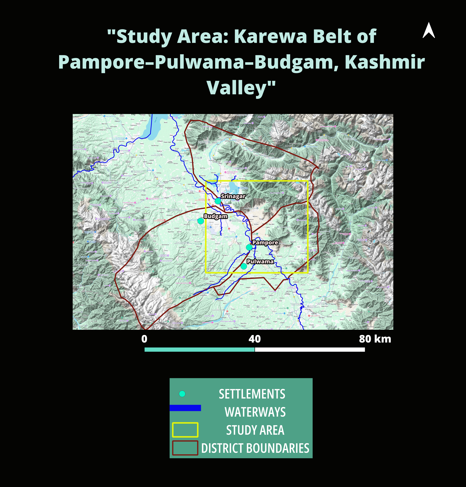

**Figure 1.** Study area overview showing the Kashmir Valley karewa belt, the analytical bounding box, and key settlement reference points.

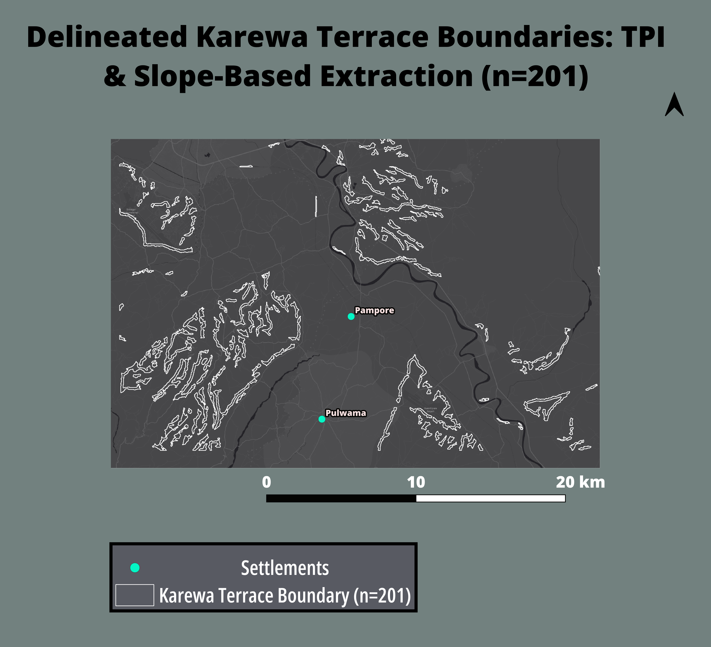

**Figure 2.** The 201 karewa terrace polygons delineated algorithmically from Topographic Position Index and slope-threshold terrain analysis.

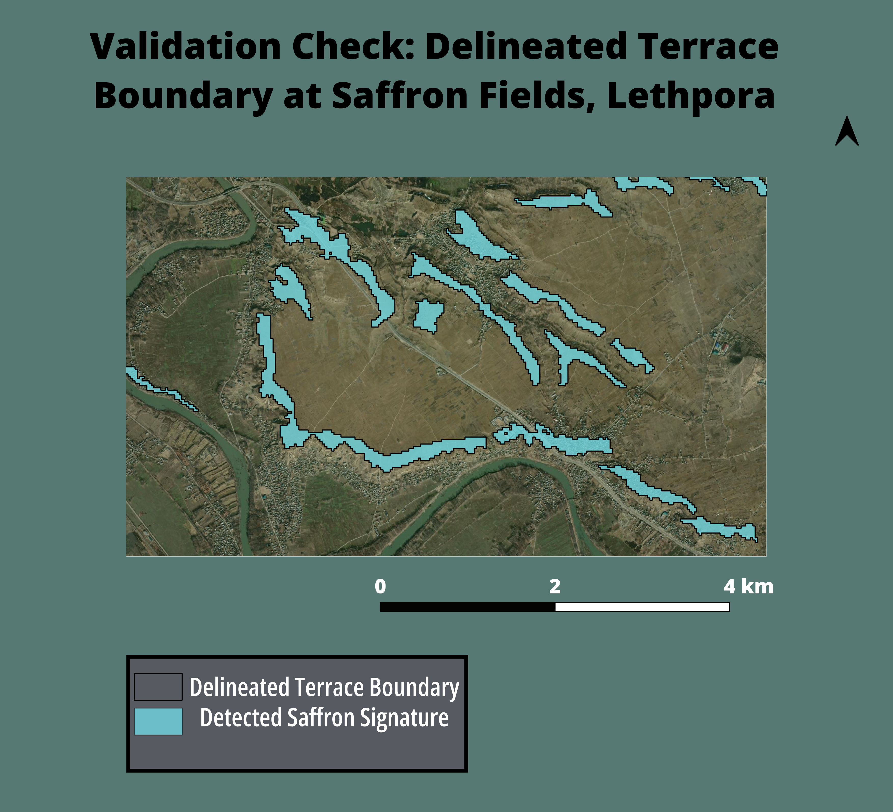

**Figure 3.** Close-range validation of the delineation pipeline against the labelled Saffron Fields, Lethpora location, confirming mapped terrace boundaries correspond to a real, known cultivation site.

### 4.2 Multi-Temporal Degradation: A Recent, Accelerating Trend

Mean bare-earth fraction across all 201 terraces was essentially flat between 1994 and 2015 (1.84% → 2.62% → 2.63%), before more than tripling between 2015 and 2025 (2.63% → 8.43%). Of the 201 terraces, 25 (12.4%) crossed the threshold for likely degradation over the full study period.

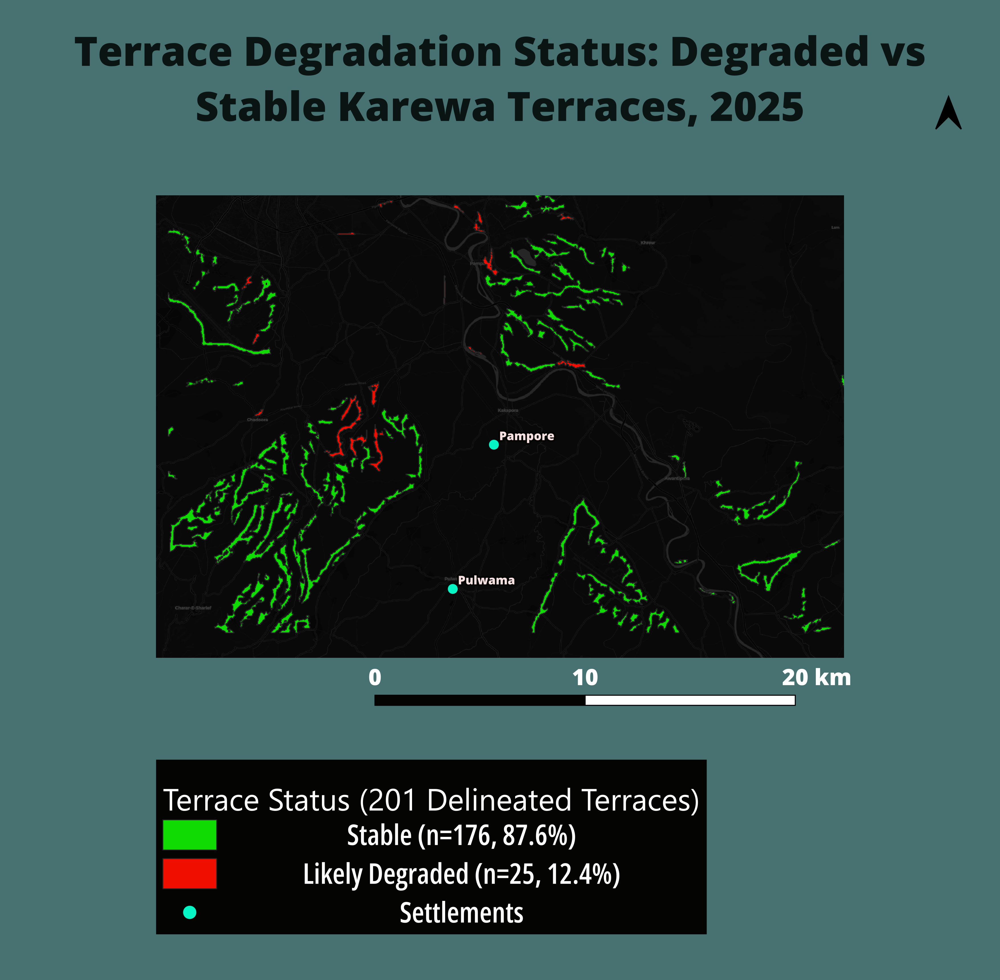

**Figure 4.** Terrace-level degradation status, 1994–2025, showing the spatial distribution of likely-degraded terraces (25 of 201) relative to stable terraces.

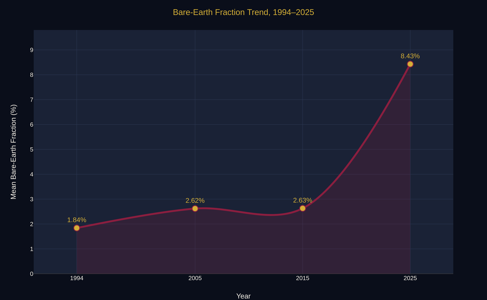

**Figure 5.** Mean bare-earth fraction across all 201 terraces at four time points, showing three decades of relative stability followed by a sharp post-2015 acceleration.

### 4.3 Absolute Area Lost and Its Concentration

Converting bare-earth fraction into absolute area, total bare-earth cover across all 201 terraces rose from 32.2 hectares in 1994 to 222.6 hectares in 2025 — a net conversion of 190.3 hectares, 5.8% of total mapped terrace area. Of this net loss, 128.2 hectares (67%) occurred within the 25 terraces already flagged as likely-degraded, even though those terraces account for only 9.7% of total mapped area: loss is heavily concentrated rather than diffuse.

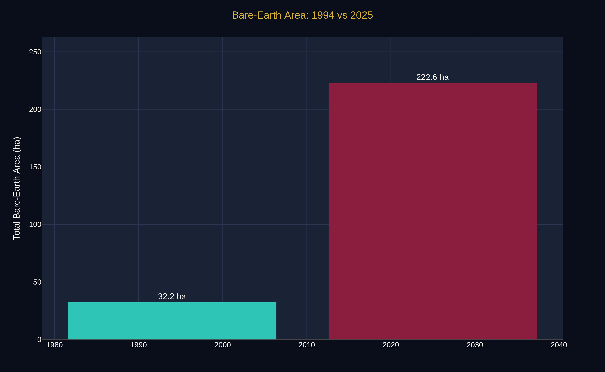

**Figure 6.** Total bare-earth area across all mapped terraces, 1994 versus 2025.

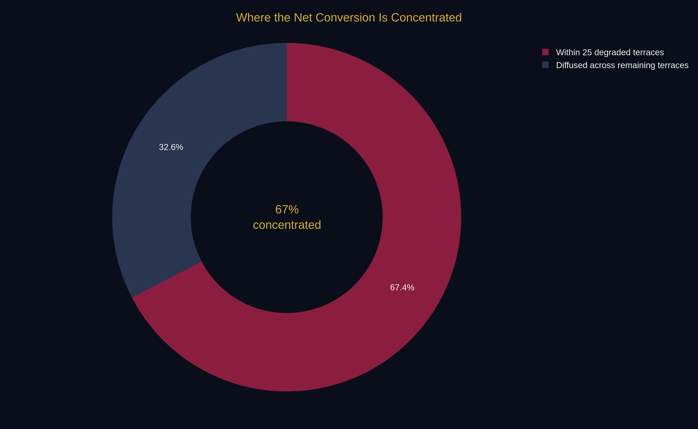

**Figure 7.** Share of total net bare-earth loss occurring within the 25 terraces flagged as likely-degraded, relative to their share of total mapped terrace area.

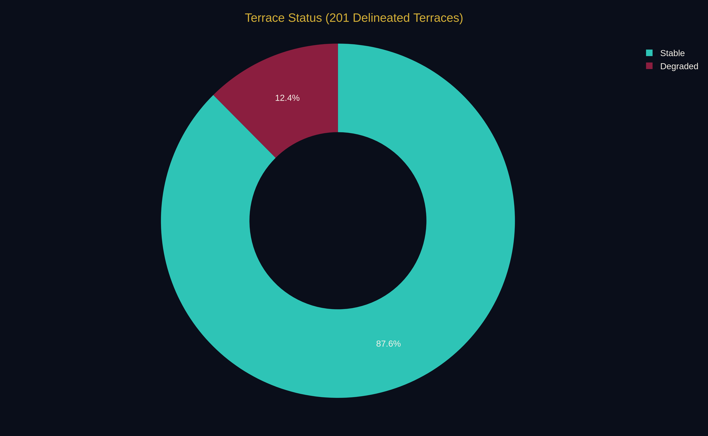

**Figure 8.** Classification split of all 201 delineated terraces into likely-degraded (25) and stable (176) categories.

### 4.4 Saffron Vulnerability and Proximity Risk

The Saffron Index flagged 14 of 201 terraces as likely saffron-cultivating, totalling 225.4 hectares — a smaller figure than the FAO's 3,200-hectare Pampore baseline, attributed to a compounding detection-recall limitation across the terrace-delineation and saffron-signature filtering stages rather than genuine crop-area loss, particularly given independently reported saffron production highs over the same period. No saffron terrace directly overlapped a degraded terrace, but the nearest sat just 80 m from an active degradation zone, and 6 of 14 (43%) fell within 1 km of one. A sensitivity check across the 500 m–2,500 m threshold range showed a smooth, monotonic increase in affected share (21% at 500 m, rising through 29%, 43%, 71%, and 86%, to 93% at 2,500 m), confirming this as a genuine spatial pattern rather than an artefact of the chosen cutoff.

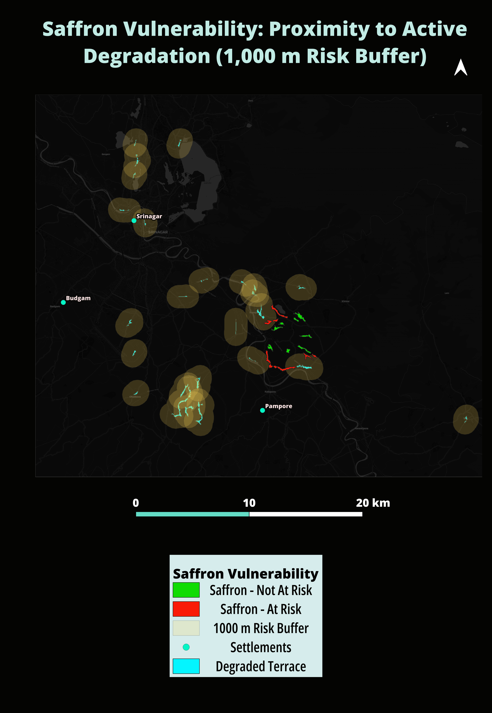

**Figure 9.** Detected saffron-cultivating terraces overlaid against proximity to the nearest degraded terrace.

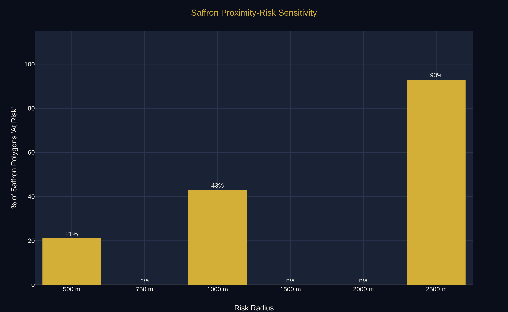

**Figure 10.** Share of saffron-cultivating terraces classified "at risk" across a range of proximity thresholds to the nearest degraded terrace, from 500 m to 2,500 m.

At official 2024-25 state yield and value figures (5.27 kg/ha, an implied Rs 2.73 lakh/kg), the 225.4 ha this study detects as saffron-cultivating represents an estimated Rs 32.4 crore in annual production value. Of that, the six terraces within the 1 km at-risk radius — 123.6 ha, 54.8% of the detected saffron area — account for an estimated Rs 17.8 crore annually. This is a value-at-risk figure, not a loss estimate: it expresses how much annual production value currently sits within proximity range of active degradation, consistent with the finding earlier in this section that no saffron terrace directly overlaps mapped loss yet (see Figure 15).

### 4.5 Infrastructure Association: Degradation Follows Roads and Settlements

Degraded terraces sat a mean 75.6 m from the nearest road (median 0.0 m — over half directly adjacent to or intersecting a road), compared to 133.1 m (median 38.5 m) for intact terraces. A one-sided Mann-Whitney U test confirmed this difference as statistically significant (p = 0.0116). The same test against the nearest building footprint (3,266 features, OpenStreetMap) shows an even stronger pattern: degraded terraces sat a mean 455.9 m from the nearest building (median 202.0 m) against 999.7 m (median 816.6 m) for intact terraces — a highly significant difference (p = 0.0001) and, at rank-biserial r = 0.465, the strongest effect of any statistical test in this study (Section 4.9). Roads and settlements are correlated but not identical infrastructure layers, so their agreement here is a second, independent line of evidence for the same accessibility-driven pattern rather than a restatement of the road result.

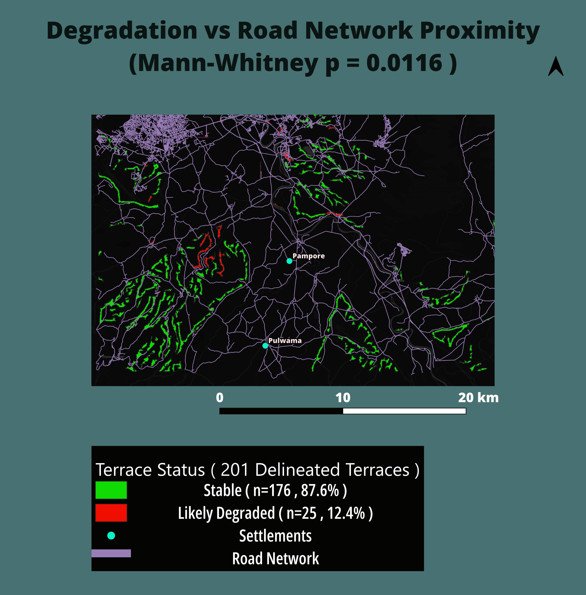

**Figure 11.** Degraded and intact terraces overlaid against the OpenStreetMap drivable road network, illustrating the closer road proximity of degraded terraces.

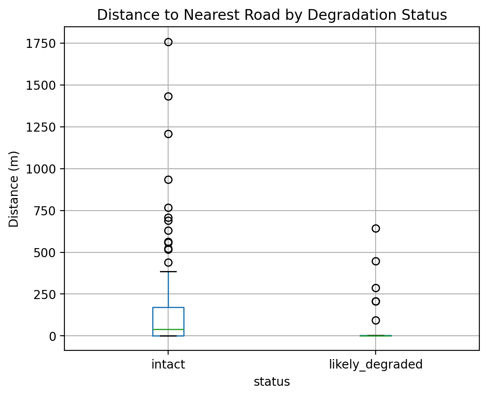

**Figure 12.** Distribution of terrace-to-nearest-road distance, compared between degraded and intact terraces (Mann-Whitney U, p = 0.0116).

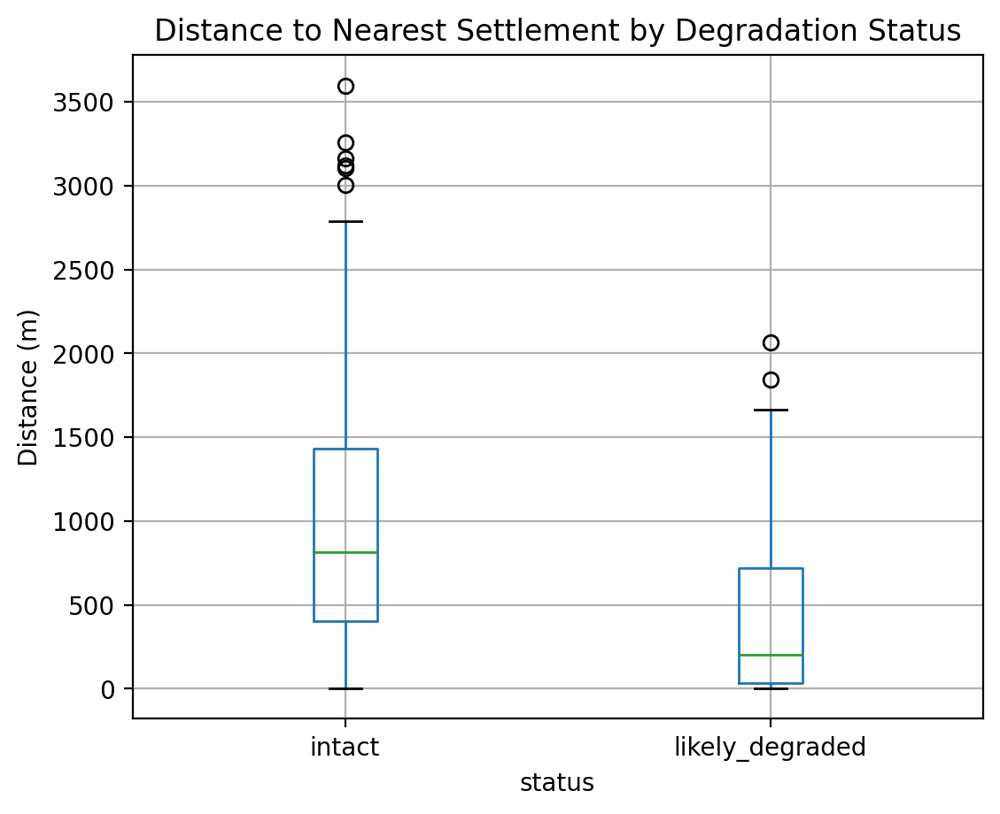

**Figure 13.** Distribution of terrace-to-nearest-building distance, compared between degraded and intact terraces (Mann-Whitney U, p = 0.0001).

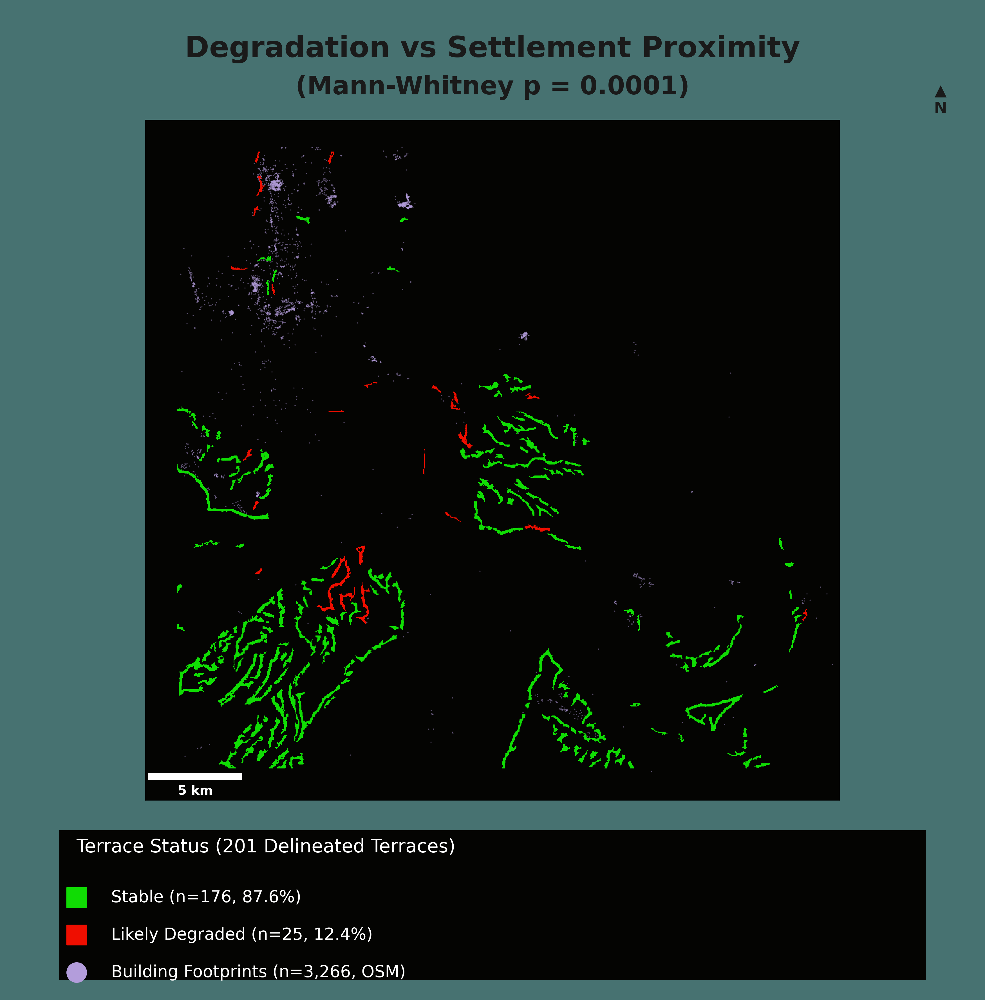

**Figure 14.** Terrace degradation status overlaid against 3,266 OpenStreetMap building footprints, the spatial counterpart to Figure 13's distance distribution.

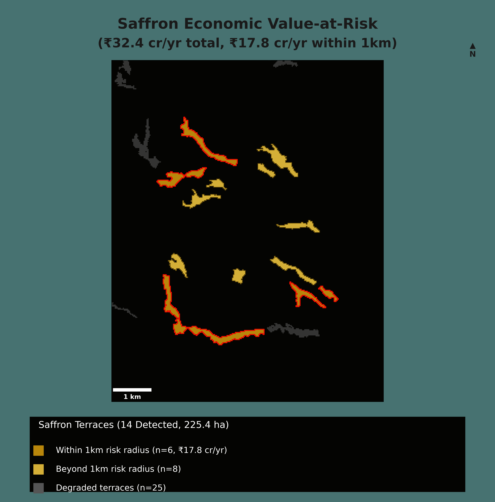

**Figure 15.** The six saffron terraces within the 1 km degradation-proximity radius (Rs 17.8 crore/year) against the eight beyond it, relative to the 25 degraded terraces.

### 4.6 Geomorphometric Comparison: Compactness and Slope

Degraded terraces show a significantly lower compactness index than intact terraces (mean 0.138 vs. 0.191, Mann-Whitney p = 0.0044) — that is, degraded polygons trace a more irregular, dissected outline than intact ones, consistent with mining excavation cutting irregular scars into an originally smoother terrace boundary rather than removing terrace surface uniformly. Mean internal slope does not differ significantly between the two groups (2.89° intact vs. 3.06° degraded, p = 0.1711), indicating that degradation is not simply concentrated on steeper, more erosion-prone terrace margins. Together these results add a purely geometric line of evidence — independent of the spectral bare-earth signal — that the same 25 terraces flagged by the land-cover analysis also carry a distinct shape signature.

### 4.7 Threshold Sensitivity

The degradation classification is stable across a broad neighbourhood of the chosen 15-percentage-point threshold: the 12-20 point range flags between 23 and 31 terraces (versus the reported 25), a smooth gradient rather than a discontinuity, and even the extremes tested (5 and 30 points) flag 49 and 14 terraces respectively — a wide but monotonic response, not a cliff edge at 15. The saffron-signature threshold shows a similar pattern for the proximity-risk share specifically: across the 0.05-0.175 range, the percentage of detected saffron terraces within 1 km of degradation stays within 39-44% (versus the reported 43%), only becoming noisy above 0.175 where the detected count falls to 4-6 terraces and any percentage is unstable on such a small base. The TPI/slope terrace-delineation grid (TPI ∈ {2,3,4}, slope ∈ {6°,8°,10°}) is smooth and monotonic around the chosen (3, 8) pair, ranging from 144 to 279 candidate polygons before the elevation filter, with the reported pair sitting centrally rather than at an extreme. None of this constitutes formal accuracy validation against ground truth — no independently labelled reference set exists for this landscape — but it does show that the reported counts are not artefacts of one arbitrarily favourable cutoff.

### 4.8 Resolution-Mismatch Robustness Check

Resampling the 2025 Sentinel-2 composite from its native ~10 m to 30 m (matching the Landsat pixel size used in 1994, 2005, and 2015) reduces the mean bare-earth fraction from 8.43% to 7.48% (−0.94 percentage points) and the net 1994-2025 conversion from 190.3 ha to 165.2 ha, with the degraded-terrace count falling from 25 to 23. The resolution mismatch therefore does inflate the apparent post-2015 acceleration to a modest, quantifiable degree — roughly 13% of the net-conversion figure — rather than the effect being negligible. Critically, though, the acceleration itself survives resolution-matching: even at 30 m, 2025's 7.48% remains approximately 2.8 times the flat 2005/2015 baseline of ~2.6%, so the paper's central claim — recent, accelerating degradation rather than a steady multi-decadal process — is not an artefact of the sensor change, even though its precise magnitude is somewhat sensor-dependent.

### 4.9 Effect Sizes and Multiple-Comparison Correction

Rank-biserial correlation, a nonparametric effect-size measure appropriate alongside the Mann-Whitney U test, was computed for all four status comparisons reported in this study: settlement proximity (r = 0.465), compactness (r = 0.352), road proximity (r = 0.268), and slope (r = −0.170). Settlement proximity is the strongest effect in the study — moderate-to-large by conventional benchmarks — with road proximity and compactness both small-to-moderate; slope is negligible. This is a more complete characterisation than the p-values alone convey. Applying a Holm-Bonferroni correction across the four tests (family-wise α = 0.05), settlement proximity (p = 0.0001, adjusted threshold 0.0125), compactness (p = 0.0044, adjusted threshold 0.0167), and road proximity (p = 0.0116, adjusted threshold 0.025) all remain significant; slope was already non-significant before correction (p = 0.1711).

## 5. Discussion

The central finding of this study — that karewa degradation is recent, accelerating, and spatially concentrated rather than a slow, uniform, multi-decadal process — is directly consistent with the grey-literature accounts reviewed above, which describe intensifying mining pressure over roughly the same recent-decade window rather than a steady historical trend (Rafi & Syed, 2023). The road-proximity result (p = 0.0116) and the even stronger settlement-proximity result (p = 0.0001, r = 0.465) lend independent, quantitative support to what that reporting describes qualitatively as extraction driven by transport economics: material moves to market most cheaply where roads and labour already exist, and this study's data confirm that degraded terraces are measurably, not just anecdotally, closer to both kinds of infrastructure than intact ones (Engert et al., 2025). That settlement proximity is the stronger of the two signals is worth reading carefully rather than at face value — it is consistent with an accessibility-driven extraction model, but also with the more basic fact that mining activity itself tends to be staffed and serviced from nearby built-up areas, so settlement distance may be picking up a general human-activity gradient rather than a road-specific transport-economics mechanism in particular. Both infrastructure associations are correlational, not causal: no dated road- or settlement-expansion record was available to establish which came first. All are consistent with an accessibility-driven extraction model, and disentangling direction of causality is left to future work with temporal infrastructure data.

The compactness result (Section 4.6) offers a second, independent line of evidence for the same 25 terraces: a shape-based signal that does not depend on the NDVI threshold used to define bare-earth fraction, strengthening confidence that the degradation classification reflects a genuine physical process rather than an artefact of a single spectral index.

The saffron-proximity finding reframes the crop's risk profile usefully: rather than reporting a direct-loss statistic that the data do not yet support, the 43%-within-1-km result establishes an early-warning pattern — proximity as a leading indicator, not a lagging one. The detected saffron area's shortfall against the FAO baseline (Section 6) is best read as a bound on this finding rather than a threat to it: the 14 detected terraces are the subset the phenological signature could identify with highest confidence, and the sensitivity analysis (Section 4.7) shows the proximity-risk share is stable across a wide range of detection thresholds rather than being an artefact of the specific 0.15 cutoff. If anything, a detection method with higher recall would be more likely to also catch smaller, less spectrally distinct saffron parcels — which, being smaller, plausibly sit nearer the margins of already-mined terrain — making the reported 43% a plausible conservative floor rather than an inflated estimate. Expressing this proximity pattern as an estimated Rs 17.8 crore in annual production value (Section 4.4) rather than a hectare count alone is deliberate: hectares are legible to a geospatial audience, but rupee figures are what move a district agriculture office or a legislative budget line, and this study's policy relevance depends on being readable by both. Read alongside the reported Rs 400 crore PM Saffron Mission investment and its 2,598-hectare rejuvenation target (Press Post, 2026), this study's terrace-level degradation and proximity-risk maps constitute the kind of empirically verified risk surface that a genuine policy-alignment evaluation would need — a comparison this study is not yet able to make directly, given current constraints on publicly accessible, scheme-level spatial data, but one its outputs are positioned to support once such data becomes available.

The governance picture this study finds is not merely one of misaligned targeting (RQ4) but of an absent legal baseline entirely: no statute currently protects karewa land from excavation in Jammu & Kashmir. A private member's bill introduced by Dr. Syed Bashir Veeri, MLA for Bijbehara, would prohibit clay, sand, and gravel excavation in ecologically sensitive karewa zones, permit mining only in already-degraded areas subject to J&K State Environmental Impact Assessment Authority approval, and establish a dedicated Karewa Protection Authority with penalties of up to Rs 10 lakh and five years' imprisonment for violations — but as of the most recent reporting located for this study, it remained pending rather than enacted, with the Revenue and Geology & Mining Departments continuing to issue the excavation permissions the bill would restrict. This matters for how this study's findings should be read: the road- and settlement-proximity results are not evidence of enforcement failure against an existing rule, since no rule currently exists to enforce — they instead describe the spatial signature of extraction proceeding in a genuinely unregulated space. That distinction changes the policy ask this study supports, from "enforce existing protections more consistently" to "establish a protection regime in the first place," informed by exactly the kind of terrace-level risk map this study produces.

## 6. Limitations

Detected saffron cultivation area (225.4 ha) falls well below the FAO GIAHS-documented baseline (3,200 ha), a shortfall attributed to compounding recall limitations across two conservative filtering stages — terrace delineation followed by saffron-signature thresholding — rather than to genuine crop-area loss, and reported transparently as a methodological constraint rather than adjusted to fit expectation; Section 5 discusses why this bounds the proximity-risk finding rather than undermining it. Governance-alignment testing (RQ4) could not be completed statistically within this study: a targeted search for spatially resolved PM Saffron Mission site- or district-level allocation data returned only aggregate, valley-wide figures (Press Post, 2026), with no locatable dataset at a resolution this study's terrace-level map could be overlaid against. RQ4 is therefore deferred to future work — ideally in partnership with the scheme's implementing agency, which would hold the disaggregated data this comparison needs — rather than estimated or answered qualitatively without a verifiable source. The multi-temporal analysis is bounded at its early end by the operational start of a usable, season-matched Landsat record; conditions prior to 1994 fall outside what satellite verification here can support. The 2025 time point uses Sentinel-2 (10 m) while 1994–2015 use Landsat (30 m); resampling the 2025 composite to 30 m and rerunning the pipeline (Section 4.8) quantifies this effect directly — mean bare-earth fraction falls from 8.43% to 7.48% and net conversion from 190.3 ha to 165.2 ha, a real but modest inflation (roughly 13% of the net-conversion figure) that does not reverse the underlying acceleration, which independent ground-truthing and grey-literature reporting of intensified recent mining also corroborate. The 2005 time point itself required widening the Landsat 5 acquisition window to a nine-year span (2001-2009) centred on 2005 after the original June-September, single-year query returned zero images (SS_Development_Log.md); the reported 2005 bare-earth fraction is therefore a multi-year composite rather than a single-year snapshot, which may smooth over short-lived degradation episodes within that window, though it does not affect the 1994 or 2015 endpoints that anchor the trend's overall shape. The economic valuation in Section 4.4 applies a single statewide yield (5.27 kg/ha) and implied price (Rs 2.73 lakh/kg) uniformly to every detected saffron terrace, since no terrace-level or Pampore-belt-specific price and yield dataset is publicly available; actual per-terrace output plausibly varies with soil quality, rejuvenation status, and micro-climate in ways this figure cannot capture, and the GI-tagged Pampore-origin premium may push actual local prices above the state-wide average used here. The figure should therefore be read as an order-of-magnitude value-at-risk estimate rather than a precise appraisal, consistent with how the underlying hectare figures are already qualified. The legal-protection finding (Section 5) reflects the most recent legislative reporting located as of this study's research date; J&K legislative activity on the Karewa Protection Bill should be independently re-checked before this study's characterisation of "no current statute" is treated as still accurate, since a private member's bill's status can change without the kind of ongoing, systematic coverage this study's other data sources receive. Finally, all degradation, saffron, and delineation classifications rest on threshold values validated by visual inspection and a sensitivity sweep (Section 4.7) rather than a formal accuracy assessment against independently labelled ground-truth points (a confusion matrix with producer's/user's accuracy); no such reference dataset exists for this landscape, and constructing one — via manual interpretation of historical high-resolution imagery — is identified as the highest-priority item for future work.

## 7. Conclusion

This study finds that Kashmir's karewa terraces are undergoing measurable, accelerating degradation concentrated in the decade since 2015, that this degradation is significantly associated with proximity to both road and settlement infrastructure rather than randomly distributed, and that the saffron economy dependent on these terraces — while not yet directly overlapping mapped loss, and representing an estimated Rs 17.8 crore in annual production value sitting within proximity range of it — sits close enough to active degradation fronts to warrant treating proximity itself as the operative vulnerability metric. This is occurring in the near-total absence of a legal protection regime: no statute currently governs karewa excavation in Jammu & Kashmir, and a pending private member's bill remains unenacted. The resulting implication for policy is direct and twofold: resources allocated to saffron-sector rejuvenation should be evaluated against where degradation risk is empirically concentrated rather than assumed to already be aligned with it, and the case for enacting a dedicated karewa-protection statute rests on evidence, produced here, that the landform's loss is real, accelerating, economically consequential, and currently unconstrained by any binding legal instrument.

## References

De Terra, H., & Paterson, T. T. (1939). *Studies on the Ice Age in India and Associated Human Cultures.* Carnegie Institution of Washington. [Full text](https://archive.org/details/dli.pahar.2748)

Dar, R. A., & Zeeden, C. (2020). Loess-Palaeosol Sequences in the Kashmir Valley, NW Himalayas: A Review. *Frontiers in Earth Science*, 8, 113. [https://doi.org/10.3389/feart.2020.00113](https://doi.org/10.3389/feart.2020.00113)

Bhat, G. R., Bali, B. S., Balaji, S., Iqbal, V., & Balakrishna. (2016). Earthquake triggered soft sediment deformational structures (seismites) in the Karewa formations of Kashmir valley—An indicator for palaeo-seismicity. *Journal of the Geological Society of India*, 87(4), 439–452. [https://doi.org/10.1007/s12594-016-0412-y](https://doi.org/10.1007/s12594-016-0412-y)

Weiss, A. D. (2001). Topographic Position and Landforms Analysis. Poster presented at the ESRI International User Conference, San Diego, CA. [Poster PDF](https://www.jennessent.com/downloads/TPI-poster-TNC_18x22.pdf)

Boeing, G. (2017). OSMnx: New Methods for Acquiring, Constructing, Analyzing, and Visualizing Complex Street Networks. *Computers, Environment and Urban Systems*, 65, 126–139. [https://doi.org/10.1016/j.compenvurbsys.2017.05.004](https://doi.org/10.1016/j.compenvurbsys.2017.05.004)

Madasa, A., Orimoloye, I. R., & Ololade, O. O. (2021). Application of geospatial indices for mapping land cover/use change detection in a mining area. *Journal of African Earth Sciences*, 175, 104108. [https://doi.org/10.1016/j.jafrearsci.2021.104108](https://doi.org/10.1016/j.jafrearsci.2021.104108)

Mann, H. B., & Whitney, D. R. (1947). On a Test of Whether one of Two Random Variables is Stochastically Larger than the Other. *Annals of Mathematical Statistics*, 18(1), 50–60. [https://doi.org/10.1214/aoms/1177730491](https://doi.org/10.1214/aoms/1177730491)

Engert, J. E., Souza, C. M., Kleinschroth, F., Ishida, F. Y., Costa, S. P., Botelho, J., & Laurance, W. F. (2025). Road expansion risk predicts future hotspots of tropical deforestation. *Proceedings of the National Academy of Sciences*, 122(52). [https://doi.org/10.1073/pnas.2502426122](https://doi.org/10.1073/pnas.2502426122)

Rafi, A. B., & Syed, S. (2023, January 27). Nourishing soils of Kashmir's karewas crumble under infrastructure. *Mongabay India*. [Read](https://india.mongabay.com/2023/01/nourishing-soils-of-kashmirs-karewas-crumble-under-infrastructure/)

Deccan Herald. (2022, March 13). Saffron boom in Kashmir: Highest production in 25 years. [Read](https://www.deccanherald.com/india/saffron-boom-in-kashmir-highest-production-in-25-years-1090848.html)

FAO GIAHS. (2012). *Saffron Heritage Site of Kashmir in India* (Part 1). Globally Important Agricultural Heritage Systems Pilot Project, SKUAST-K. [Read](https://www.fao.org/3/bp791e/bp791e.pdf)

Press Post. (2026). Rs 400 cr PM Saffron Mission halts slide in Kashmir, 2,598 ha brought under rejuvenation. [Read](https://india.presspost.in/rs-400-cr-pm-saffron-mission-halts-slide-in-kashmir-2598-ha-brought-under-rejuvenation)

Greater Kashmir. (2026, February 18). J&K Saffron output drops to 19.58 MT in 2024-25: Govt. [Read](https://www.greaterkashmir.com/business/jk-saffron-output-drops-to-19-58-mt-in-2024-25-govt)

Kashmir Life. (2026, February 12). Kashmir's Saffron Sold for Rs 534.53 Cr in 2024-25, Govt Tells Assembly. [Read](https://kashmirlife.net/kashmirs-saffron-sold-for-rs-534-53-cr-in-2024-25-govt-tells-assembly-424949/)

Kashmir Reader. (2026, February 13). Over 90 metric tonnes of saffron produced in last five years in J&K: Govt. [Read](https://kashmirreader.com/2026/02/13/over-90-metric-tonnes-of-saffron-produced-in-last-five-years-in-jk-govt/)

Kashmir Observer. (2025, February 22). Will the Karewa Protection Bill Become a Law in J&K? [Read](https://kashmirobserver.net/2025/02/22/will-the-karewa-protection-bill-become-a-law-in-jk/)

Greater Kashmir. (2025, February 28). Why do Karewas need legal Protection in J&K? [Read](https://www.greaterkashmir.com/opinion/why-do-karewas-need-legal-protection-in-jk/)

