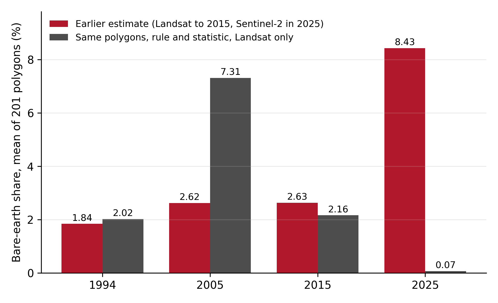
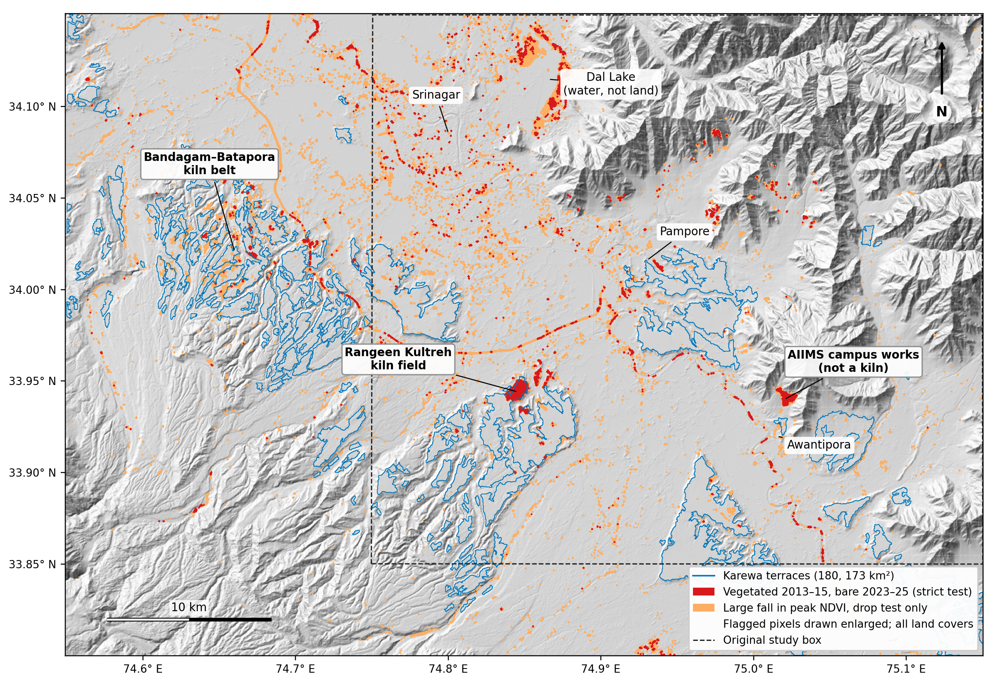
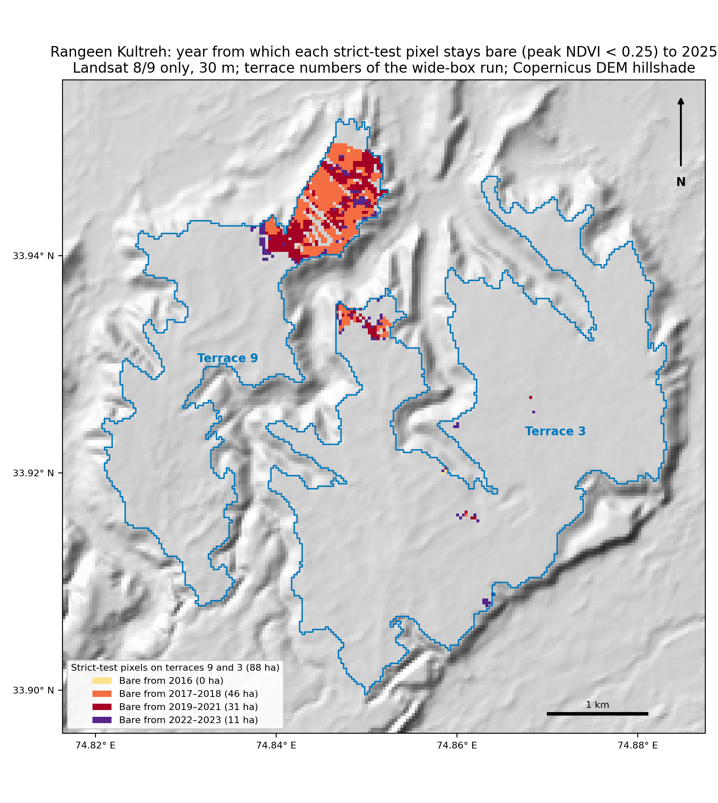
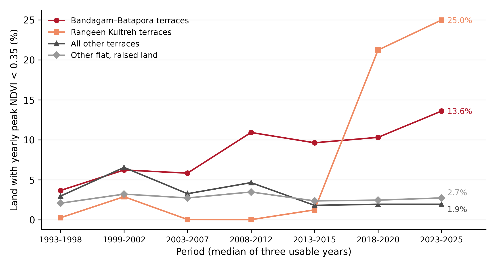

# Stolen Strata: Brick Kilns and the Loss of Karewa Tableland in Budgam, Kashmir, 1993–2025, with a Correction to an Earlier Estimate

Sakshi D. Maske

*Independent Geospatial Researcher*

*This version replaces the preprint of 4 September 2026. The main numbers of that preprint (a rise in bare-earth share from 1.84% to 8.43% and a net increase of 190.3 ha) were found to be an artefact of changing sensors and are withdrawn. Section 4.1 shows the check.*

## Abstract

Karewa tablelands are the flat-topped, scarp-bounded remnants of the old lake and river deposits of the Kashmir Valley. Reporting from Kashmir has said for years that they are being dug away for brick clay and fill, but I did not find a study that measures how much, where and when from satellite data. An earlier version of this work tried, and reported that the bare-earth share of karewa terraces rose from 1.84% in 1994 to 8.43% in 2025. That result does not survive a simple test. It compared Landsat images up to 2015 with a Sentinel-2 image in 2025. When the same polygons, the same rule and the same statistic are run on Landsat alone, the 2025 figure is 0.07%, not 8.43%. This paper starts again. I map 180 scarp-bounded karewa terraces (173.3 km²) in a 2,160 km² box across Budgam, Pulwama and Srinagar districts using slope, height above drainage and the share of each flat top's edge that is a scarp, and I check that map against a published geological map. I then follow the yearly peak NDVI of every 30 m pixel from 1993 to 2025 using Landsat only, and test for land that was clearly vegetated in 2013–2015 and is not in 2023–2025. A strict version of the test finds 107 ha on terraces and a looser one finds 329 ha (286 ha net of change in the opposite direction). Terraces convert several times faster than other flat, raised land in every variant I tried. A blind sample of 120 points, labelled by hand against 2026 imagery, shows that the vegetation is indeed gone at 100% of strict and 85% of looser detections, and that about 141 ha of the flagged land (95% interval roughly 110–172 ha) lies inside brick-kiln fields, about 40 ha of it directly under kilns and rows of bricks. The loss sits in two places. At Rangeen Kultreh a kiln field appears after 2015 and covers about a quarter of its terrace by 2025; a pollution-control filing before the National Green Tribunal independently dates a kiln there to 2017. On the Bandagam–Batapora tablelands the land that never greens up grows from about 100 ha in the mid-1990s to 378 ha now. A longer comparison back to the mid-1990s points the same way for these two belts, a net loss of roughly 335 ha against none on the remaining 140 km² of terraces, but the Landsat record before 2013 is thin and noisy here and I treat that figure as indicative only. I could not measure how deep the ground was dug, and I found no link between this loss and the saffron land at Pampore.

**Keywords:** karewa, Kashmir Valley, brick kilns, land conversion, Landsat time series, sensor consistency, accuracy assessment

## 1. Introduction

Karewas are the raised, flat-topped plateaus that stand above the floor of the Kashmir Valley. They are made of lake and river sediments laid down over the last few million years and capped with loess, and they carry orchards, saffron and dry-land crops. They are also a convenient source of clay. Journalists and activists in Kashmir have reported for more than a decade that karewas are being cut for brick kilns, for railway and road embankments, and for building plots (Rafi and Syed, 2023; Bhat, 2021).

That is what the reporting says. What I could not find was a measurement: how many hectares, in which places, starting when, taken from satellite data and not from testimony. The first version of this study tried to supply one and got it wrong. It reported that bare ground on karewa terraces had more than quadrupled since 1994, with almost all of the rise after 2015, and it built a saffron value-at-risk figure on top of that. The rise coincided exactly with the point where the analysis switched from Landsat to Sentinel-2 imagery. I had noted that as a limitation. It was more than a limitation. It was the result.

This paper does three things. It shows why the earlier number was wrong, so that nobody carries it forward. It rebuilds the analysis so that every comparison through time is made inside one sensor family, on a terrace map that is checked against independent geology. And it reports what is left when that is done, which is smaller than the earlier claim, concentrated in two brick-kiln belts in Budgam district, and supported by a hand-labelled accuracy sample and by an official document.

I use "karewa tableland" and "terrace" for the scarp-bounded flat tops this study maps. That is a narrower thing than the whole Karewa Group outcrop, and Section 3.2 and Section 6 say how much narrower.

## 2. Background

### 2.1 The karewa landscape

De Terra and Paterson (1939) set out the first systematic stratigraphy of the Karewa deposits as a lake-to-river infill tied to the uplift of the Pir Panjal. Dar and Zeeden (2020) review the loess and palaeosol sequences that cap the karewa surfaces and their value as a Quaternary climate archive, and their Figure 2, redrawn after Bhatt (1982), maps where the Karewa formations lie across the valley. Bhat et al. (2016) describe earthquake-related deformation structures in the same sediments. The surface being removed is therefore both farmland and a geological record.

### 2.2 Brick kilns in Budgam

Budgam district holds most of Kashmir's brick kilns. A feature in Kashmir Life (2019) traces the industry from the Jhelum belt in the 1960s to the Budgam karewas from the mid-1970s. The Jammu and Kashmir Pollution Control Committee reported 213 kilns in the district in April 2023, with 96 notices for lapsed consent and 46 closure orders (JKPCC, 2023). At Rangeen Kultreh in Chadoora tehsil, press reports describe about two dozen kilns on karewa land, the felling of about a thousand almond trees for new ones, and a complaint by the Air Force Station at Srinagar that kilns around it had multiplied over the previous decade (Bhat, 2023; Kashmir Despatch, 2023; Business Standard, 2023). A committee report filed before the National Green Tribunal in a case brought by one kiln at Rangeen states that the kiln was commissioned in 2017 without consent, was ordered closed in September 2018, and has 20 other kilns within one kilometre (JKPCC, 2024).

### 2.3 Saffron

The saffron belt at Pampore is the best known use of karewa land. Official figures put the cultivated area at 3,715 ha since 2010–11, down from 5,707 ha in the 1990s, with production of 19.58 t in 2024–25 (Kashmir Reader, 2026; Greater Kashmir, 2026); FAO GIAHS (2012) describes the system. The earlier version of this paper tied its degradation estimate to saffron value. Section 4.7 explains why this version does not.

### 2.4 Measuring change across sensors

Long satellite records are stitched from different instruments. Landsat 5 and 7 carry similar sensors; Landsat 8 and 9 carry a different one with narrower bands, and Roy et al. (2016) give the adjustment between them. Sentinel-2 differs again in band placement, pixel size and processing. A fixed NDVI threshold applied across such a join can register a change that is only the instrument changing. Section 4.1 is a case of exactly that.

## 3. Data and Methods

Everything is scripted. Satellite composites were exported from Google Earth Engine (Gorelick et al., 2017) and analysed locally in Python. The scripts, tables and maps are in the `v2_redesign` folder of the project repository; the large rasters are regenerated by the export scripts and are not stored in the repository.

### 3.1 Study area

The study box runs from 74.55° to 75.15° E and from 33.80° to 34.15° N, about 2,160 km², covering the karewa tablelands of Budgam, the Pampore–Lethpora tablelands, and parts of Pulwama and Srinagar districts. The first analysis used a smaller box (74.75°–75.15° E, 33.85°–34.15° N) drawn around Pampore. It was widened westward once it became clear that the change was in Budgam.

### 3.2 Terrace delineation

The earlier version selected cells with a high topographic position index and a slope under 8°. That rule picks out rims and spurs, and it left the flat plateau interiors out; my own field photographs at Lethpora fell outside every polygon it produced. The new rule looks for the flat top itself and then asks whether it is bounded by scarps.

From the Copernicus GLO-30 elevation model (acquired 2011–2015), reprojected to UTM 43N with a buffer of about 10 km around the box, I compute slope on a lightly smoothed surface and height above the nearest drainage, HAND (Rennó et al., 2008), with drainage lines defined by a contributing area of 3 km². A cell is a candidate if its slope is under 4°, its HAND is over 15 m and its elevation is under 1,950 m. Candidates are cleaned with a 2-pixel opening and grouped into connected flat tops of at least 0.05 km². For each flat top I measure the share of a 3-pixel ring just outside it that is steeper than 6°. This scarp share separates a tableland, which drops away on most sides, from an alluvial fan or a valley-side apron, which is flat and raised but slopes gently into its surroundings.

The scarp-share cut-off was set from independent evidence, not by eye. In the original box I georeferenced the Karewa Group map of Dar and Zeeden (2020, Figure 2) and measured, for each flat top large enough for that map to resolve, how much of it lies on Karewa formations. At a scarp share of 0.25 or more, 90% of those flat tops are on Karewa formations; at 0.20 the figure falls to 79%. The cut-off is therefore 0.25. That comparison rests on a few dozen flat tops, and because the same map is used in Section 4.2 to report agreement, the agreement reported there is not a fully independent test of the cut-off. Five small flat tops that pass the rule but look like foothill aprons or valley floors inside the mountains (1.9 km² together in the original box; the matching flat tops in the wide box come to 1.2 km², under 1% of the terrace area) were removed after a first-pass review of terrain and satellite imagery; I have not yet confirmed those labels myself. They are listed with reasons in the repository.

The same rule, unchanged, was then run on the wide box.

### 3.3 Satellite time series

For every year from 1990 to 2025 I took all Landsat 5, 7, 8 and 9 Collection 2 Level 2 surface-reflectance scenes over the box, masked cloud, dilated cloud, shadow and snow with the pixel-quality band, and computed NDVI. For each pixel and year I kept the 90th percentile of NDVI over the whole year. The yearly peak is the useful quantity here: a field that is bare in winter or at harvest still has a high peak, while ground that has been stripped stays low all year. Three series were built:

- Landsat 5, 7, 8 and 9 together, with Landsat 8 and 9 red and near-infrared adjusted to Landsat 7 using the coefficients of Roy et al. (2016), for the long view;
- Landsat 8 and 9 alone, unadjusted, 2013–2025, which is the series the conversion tests use;
- Landsat 7 alone, 2013–2021, as an independent check on the Landsat 8 result.

A Sentinel-2 series for 2019–2025, cloud-masked with Cloud Score+ (Pasquarella et al., 2023) and exported at 30 m, serves as a third instrument. I also exported the number of clear observations per pixel per year. A year is used only if the median terrace pixel has at least 10 clear observations. That removes 1990, 1991, 1992, 1995, 1996 and 1997.

For the check on the earlier estimate I also exported the June–September median NDVI, which is what the earlier version used.

### 3.4 Conversion tests

All tests compare two three-year windows inside one series, so that a single dry or cloudy year cannot create or remove a detection.

*Strict test.* A pixel is converted if its yearly peak NDVI was at least 0.35 in each of 2013, 2014 and 2015 and below 0.25 in each of 2023, 2024 and 2025.

*Drop test.* A pixel is converted if the median of its yearly peak was at least 0.45 in 2013–2015 and below 0.40 in 2023–2025, with a fall of at least 0.20. This was added after the strict test turned out to miss most brick-kiln land: at 30 m a kiln field is a mixture of kilns, drying rows, tracks and weeds, and its pixels sit between 0.25 and 0.45, not below 0.25.

Each test is also run in reverse (low to high), which gives a measure of noise. Results are reported for three strata: the terraces; other flat, raised land that the terrace rule rejected (fans and valley fill), which is the natural comparison; and the rest of the box.

For the long view I take, for seven periods between 1993 and 2025, the three-year median of the yearly peak in the adjusted Landsat series and count the land where it is below 0.35.

### 3.5 Accuracy sample

I drew 120 random points on terraces: 25 from pixels flagged by the strict test, 60 from pixels flagged only by the drop test, and 35 from pixels flagged by neither. The points were shuffled and the stratum of each point was kept in a separate file that I did not open until the labelling was finished. For each point I opened the 2026 satellite view in Google Maps and recorded what lies at its centre: kiln ground, vegetated, built-up, road, other bare ground, water or unclear. Because bare worked ground inside a kiln field cannot be told from other bare ground at close zoom, the 68 points first labelled as bare or road were looked at a second time, one zoom level out, with a single question: is the point inside a brick-kiln field or not. Shares are reported with Wilson (1927) intervals and converted to areas by stratum, in the manner recommended by Olofsson et al. (2014).

### 3.6 Elevation

To test whether the ground was lowered I compared the Copernicus model with SRTM (2000) and ALOS World 3D (2006–2011), and with GEDI laser ground returns for 2019–2025 (Dubayah et al., 2020).

### 3.7 What was dropped from the earlier version

The road and settlement proximity tests, the compactness and slope comparison, the saffron proximity analysis and the rupee valuation all depended on the earlier degradation layer. Since that layer does not stand, neither do they, and they are not repeated here.

## 4. Results

### 4.1 The earlier estimate was an artefact of mixing two satellite products

The earlier version classified a pixel as bare when its June–September NDVI was below 0.15, and reported bare-earth shares of 1.84% (1994), 2.62% (2005), 2.63% (2015) and 8.43% (2025) on 201 terrace polygons. Each figure was the unweighted mean of the 201 per-polygon shares. The first three came from Landsat composites built over several years and the last from a Sentinel-2 composite.

Applying the same threshold to the same 201 polygons with Landsat throughout, and taking the same mean of polygons, gives 2.02% for 1994, 7.31% for 2005, 2.16% for 2015 and 0.07% for 2025 (Figure 2). Pooling all pixels instead of averaging polygons gives 1.15%, 5.47%, 1.11% and 0.09%. Either way the 2025 jump is not there. The comparison is not exact in one respect: the Landsat-only values use the June–September median of a single year, where the earlier version used composites of several years, so the earlier columns are not expected to agree closely.

Pixel size is not the explanation. Averaging the earlier Sentinel-2 composite onto the 30 m Landsat grid still gives 7.58%. On the same polygons in 2025 the median NDVI of that Sentinel-2 composite is 0.35, against 0.50 in the Landsat series. A gap of that size is more than the difference in band placement between the two instruments normally produces. The jump therefore came from comparing two differently built products, and I have not isolated which part of the Sentinel-2 processing (cloud masking, compositing or reflectance level) is responsible. A Sentinel-2 composite built exactly like the Landsat one would settle that. It would not change the conclusion that the 8.43% was not a change on the ground.

Two further things came out of this check. First, the summer median is not a usable measure in this valley. Before 2009 a terrace pixel had between 0 and 8 clear summer observations a year because of monsoon cloud, and the summer bare share swings from under 1% to 16% and back within a few years around 2000. The high 2005 value in the paragraph above is part of that noise. Second, the level of any bare-share figure depends on the instrument. On the terraces of the original box in 2025, the share of pixels with a yearly peak below 0.25 is 1.6% in the adjusted Landsat series, 2.3% in Landsat 8/9 unadjusted and 4.7% in Sentinel-2. A statement of the form "x% of the karewas are bare" has no single answer. Only change measured within one instrument is defensible, and the rest of this paper is confined to that.

### 4.2 The terrace map

The rule yields 274 flat tops in the wide box, of which 187 have a scarp share of 0.25 or more. Four are dropped because they match the flat tops removed in the original box (Section 3.2) and three fall below 0.05 km² once clipped to the box. The remaining 180 terraces cover 173.3 km² (Figure 1). The other flat, raised land covers 161.9 km².

Against the geological map, in the original box where the map was georeferenced, 80% of the terrace area lies on Karewa formations and 20% on alluvium, with none on reworked karewa sediments; shifting the map by up to 600 m in any direction, which is within its positional error, moves the 80% between 67% and 89%. The flat tops the rule rejects are 30% Karewa formation, 36% reworked sediments and 35% alluvium, which is what a fan is. Scarp share and share on Karewa formations are correlated across the 44 flat tops large enough to compare (Spearman 0.58).

The weak direction is coverage. The terraces include only 24% of the Karewa formation area the map shows in that box, and 38% of the flat part of it. Karewa ground that slopes gently without a bounding scarp, or that lies low near the valley floor, is not in the map. Section 4.6 shows that this omitted karewa ground behaves like ordinary valley floor in the change analysis, so the omission does not hide a second area of loss, but the unit of study is scarp-bounded tableland and not the Karewa Group as a whole.

### 4.3 Conversion after 2013

Table 1 gives both tests for 2013–2015 to 2023–2025 in the Landsat 8/9 series.

**Table 1. Land converted from vegetated to not vegetated, 2013–2015 to 2023–2025.**

| Stratum | Area (km²) | Strict test (ha) | Strict (%) | Drop test (ha) | Reverse (ha) | Drop (%) |
|---|---|---|---|---|---|---|
| Terraces | 173.3 | 107.0 | 0.62 | 328.6 | 42.8 | 1.90 |
| Other flat, raised land | 161.9 | 11.4 | 0.07 | 92.7 | 52.2 | 0.57 |
| Rest of the box | 1,826.6 | 329.0 | 0.18 | 2,049.8 | 547.9 | 1.12 |

By the strict test terraces convert about nine times faster than other flat, raised land, and by the drop test about three times faster. On terraces the reverse change is small next to the forward change (5.3 ha against 107.0 ha for the strict test, 42.8 ha against 328.6 ha for the drop test). Off the terraces the drop test picks up a great deal of change in both directions, which is what fields, building and road works produce, and I do not interpret those numbers further.

The instruments agree. For the window that Landsat 7 can cover (2013–2015 to 2019–2021) Landsat 7 alone gives 70.8 ha by the strict test on terraces and Landsat 8 gives 68.6 ha; Landsat 7 confirms 86% of the Landsat 8 drop-test pixels. Sentinel-2 puts 97% of the strict-test terrace pixels below 0.25 in each of 2023, 2024 and 2025, and its median over the drop-test pixels is 0.17.

The strict test is concentrated to an unusual degree. Eight of 180 terraces have a hectare or more, and two adjoining terraces at Rangeen Kultreh hold 87.8 ha, 82% of the total. The drop test spreads further: 27 terraces lose a hectare or more and 13 lose five or more, a cluster of them on the Bandagam–Batapora tablelands near 34.02° N, 74.66° E. Rangeen Kultreh accounts for 37% of the drop-test area.

### 4.4 Does the result depend on my choices?

*Terrace cut-offs.* Re-running the delineation with slope limits of 3°, 4° and 5° and HAND limits of 10, 15 and 20 m changes the terrace area from 106 to 258 km². The strict conversion stays between 95 and 120 ha and the drop conversion between 221 and 422 ha. Terraces convert 5 to 13 times faster than other flat land by the strict test and 2.4 to 3.7 times faster by the drop test in all nine versions. The HAND limit matters little; the slope limit matters more.

*Strict-test thresholds.* In the original box, 24 variants (bare below 0.20, 0.25 or 0.30; four vegetated limits; all three years or two of three) give 37 to 151 ha on terraces. In every variant 80% to 99% of it is on the Rangeen Kultreh terraces.

*Drop-test thresholds.* Twenty-seven variants give 234 to 374 ha net of reverse change, with terraces converting 1.9 to 5.7 times faster than other flat land.

So the hectares move with the thresholds, as they must, but the contrast with comparable land and the location of the change do not.

### 4.5 Accuracy

**Table 2. What the sample points are in 2026 imagery.**

| Stratum (terraces) | Points | Area (ha) | Kiln ground | Built-up or road | Other bare | Still vegetated | Unclear |
|---|---|---|---|---|---|---|---|
| Flagged by strict test | 25 | 107 | 19 | 2 | 4 | 0 | 0 |
| Flagged by drop test only | 60 | 224 | 16 | 17 | 16 | 9 | 2 |
| Not flagged | 35 | 17,000 | 1 | 4 | 8 | 22 | 0 |

Both tests are right that the vegetation is gone: all 25 strict points (95% interval 87–100%) and 51 of 60 drop-only points (85%, interval 74–92%) are not vegetated today. They differ in what the land became. About three quarters of strict detections are kiln ground (76%, interval 57–89%). Drop-only detections are a mixture: about a quarter kiln ground (27%, interval 17–39%), about as much again built-up land and roads, about as much other bare ground, and 15% false alarms.

Scaling by stratum area, kiln ground makes up about 81 ha of the strict detections and about 60 ha of the drop-only detections, 141 ha together, with a 95% interval of roughly 110 to 172 ha. This is the figure I put forward for karewa tableland that the satellite record shows as vegetated in 2013–2015 and that lies inside a brick-kiln field in 2026. The earlier state rests on the Landsat record alone; the check against older high-resolution imagery is not finished (Section 6).

The figure depends on the second look described in Section 3.5, and Table 3 shows by how much. Counting only points whose centre falls directly on a kiln, a drying row or stacked bricks, the estimate is about 40 ha. The other 102 ha come from points first labelled bare ground or road that turned out, one zoom level out, to lie inside a kiln field. So the 141 ha is land inside brick-kiln fields, of which roughly 40 ha is kilns and brick rows themselves and the rest is the worked, bare ground between them.

**Table 3. The kiln estimate by labelling pass.**

| Stratum (terraces) | Points | Point centre is kiln ground (first pass) | Bare or road point inside a kiln field (second pass) | Both |
|---|---|---|---|---|
| Flagged by strict test | 25 | 4 points, 17 ha | 15 points, 64 ha | 19 points, 81 ha |
| Flagged by drop test only | 60 | 6 points, 22 ha | 10 points, 37 ha | 16 points, 60 ha |
| Flagged land together | 85 | 40 ha | 102 ha | 141 ha |

The strict stratum is also concentrated. Eighteen of its 25 points fall on one terrace and 21 fall in the Rangeen Kultreh kiln field, because that is where 82% of the strict-test area lies. The 76% for the strict test is in effect a description of that one field.

Two cautions belong here and not only in the limitations. The sample shows what is on the ground now; it cannot show that the point was vegetated in 2013. And 13 of the 35 unflagged points also look non-vegetated in the 2026 image, because a dry-season picture of a karewa is largely brown. Present-day bareness on its own means little. The tests rest on the change in the satellite record.

### 4.6 Where and when

*Rangeen Kultreh.* On the terraces around 33.94° N, 74.85° E the land with a yearly peak below 0.35 was 1 ha in 1993–1998, 14 ha in 1999–2002, 0 ha in 2003–2007 and in 2008–2012, 6 ha in 2013–2015, 103 ha in 2018–2020 and 122 ha in 2023–2025, a quarter of those terraces (Figure 4). The 1999–2002 values are raised on every kind of land (6.5% on all other terraces, against 3.0% before and 3.3% after), which I read as noise in the thin record of those years and not as change. In the Landsat 8/9 series the main terrace has 1.3 ha below 0.25 in 2013, 21 ha in 2017 and 66 ha in 2018 (Figure 3). The pixels that later converted had a median yearly peak between 0.44 and 0.65 in every usable year from 1993 to 2016 except 2001 (0.31), a year in which the whole series is anomalous: 15% of all terrace pixels read as bare, against about 2% in the years on either side. Present-day imagery shows a dense field of kilns with rows of drying bricks, and the map carries the names of individual kilns. One of those names is the kiln in the National Green Tribunal filing (JKPCC, 2024), which states that it was commissioned in 2017. I obtained the satellite onset before I found that document.

One press report says the roughly two dozen kilns at Rangeen Kultreh were built between 2003 and 2012, with none permitted from 2013 to 2022 (Kashmir Despatch, 2023). The satellite record shows this block fully vegetated until 2016. Either the older kilns stand in another part of the village or the reported dates are wrong. The official filing agrees with the satellite record. I have not resolved this.

*Bandagam–Batapora.* On the tablelands between about 74.60° and 74.72° E and 33.99° and 34.05° N the same measure goes from 102 ha (3.7% of those terraces) in 1993–1998 to 304 ha in 2008–2012 and 378 ha (13.6%) in 2023–2025. The rise is not steady: across the seven periods the values are 102, 173, 162, 304, 268, 287 and 378 ha. It grew in two steps, up to about 2010 and again after 2018–2020. Imagery shows kiln ground across the villages of Bandagam, Chand Pora, Hardu Bata Pora, Nijlu and Bonahama. I found no document that names these villages; the identification rests on imagery and on the district-level count of kilns.

*Everywhere else.* On the remaining 140 km² of terraces the low-NDVI land was 417 ha (3.0%) in 1993–1998 and 273 ha (1.9%) in 2023–2025.

Running the drop test from 1993–1998 to 2023–2025 in the adjusted Landsat series gives, net of reverse change, +92 ha at Rangeen Kultreh and +243 ha at Bandagam–Batapora, about 335 ha together, and −336 ha on all other terraces. Peak NDVI is higher everywhere from 2013 because Landsat 8 adds observations (the terrace median rises from 0.58 to 0.67), which pushes this long comparison toward greening. That bias works against the losses reported for the two belts, not for them, and it is the reason I do not read the −336 ha as real greening.

I treat the 335 ha as indicative, and not as a measurement of the same standing as the 2013–2025 figures, for three reasons. The two site boxes were drawn after the pattern had been seen. Over all terraces together the same long test gives 514 ha of loss against 515 ha of change in the opposite direction, so the two belts stand out against a background that sums to zero. And before 2013 the low-NDVI land on the other terraces moves between 417 and 921 ha from one period to the next, which is as large as the signal. The Rangeen Kultreh part (+92 ha) is firm, because all of it happens after 2016 and is seen in the Landsat 8/9 record as well. The Bandagam–Batapora part (+243 ha) shows a direction and not a reliable amount.

*Is karewa being lost outside the mapped terraces?* In the original box, Karewa formation inside the terraces converted at 1.36% of its vegetated area by the strict test, Karewa formation outside the terraces at 0.19%, and plain alluvium at 0.19%. The karewa ground my terrace rule leaves out behaves like ordinary valley floor.

*What else the test finds.* The largest clusters off the terraces are the AIIMS campus under construction at Awantipora (37 ha on a hillside), about 58 ha inside Dal Lake where floating vegetation gave way to open water, road works and shifts of the Jhelum channel. The test detects loss of vegetation from any cause, which is why the kiln figure comes from the labelled sample and not from the test alone.

### 4.7 Saffron

The saffron-signature polygons of the earlier version lie around Pampore, 7 km or more from the Rangeen Kultreh kiln field, and 0.2 ha of all strict-test conversion on the terraces of the original box falls within a kilometre of them. The terraces outside the two kiln belts, which include the Pampore and Lethpora tablelands, convert at 0.39% by the drop test in the adjusted Landsat series, against 0.37% for other flat land. I therefore find no evidence in 2013–2025 that the saffron tablelands are being converted in the way the Budgam tablelands are. This says nothing about saffron decline from other causes, about villages where saffron was grown in the past and is no longer, or about the earlier decades for which the record is thin.

### 4.8 How deep

The three elevation models all predate the Rangeen Kultreh kiln field, and their differences over the converted block match the unconverted part of the same terraces to within noise (0.6–1.3 m). GEDI is precise enough on these flat surfaces (about 0.7 m), but only nine usable shots fall on the converted block, all from 2019; they show no lowering relative to the 2011–2015 surface (−0.3 m, against −0.5 m on the untouched part of the terrace that year). Nine shots support no conclusion in either direction. I cannot say how deep the ground was dug or how much material left.

## 5. Discussion

The measured change is narrower than the story usually told about the karewas, and more specific. Across 173 km² of mapped tableland, conversion of vegetated land after 2013 is rare. Where it happens it is mostly in two places, and in both it is brick kilns. Rangeen Kultreh is the clearer case because it is recent, fast and total: orchard and field in every usable year to 2016, then a kiln field over a quarter of the terrace within three years, confirmed by three instruments and dated independently by a regulator's filing. Bandagam–Batapora looks older and slower, apparently already under way in the 1990s and still growing, though its early history rests on the thin part of the record.

The contrast between the two tests is itself informative. A threshold tuned on a site that was cleared completely will undercount sites that are cleared in patches. I trusted the strict test at first because it gave a clean answer at Rangeen Kultreh, and it took a look at the imagery of the second site to see that it was missing most of a kiln landscape several kilometres across. The looser test catches that landscape but also catches houses and roads, so its area cannot be read as kiln area without the sample.

The correction in Section 4.1 has a use beyond this study. Many change analyses in data-poor regions are built the way my first version was: a handful of dates, the best available sensor for each, one threshold. The 2025 value in that version looked like a finding and was reported as one, with a robustness check that tested pixel size and not the sensor. The check that exposed it cost one extra export. Running the full rule on a single sensor family, even a coarser one, should be routine before any cross-sensor change is reported.

On regulation, the documents describe a district where a large share of kilns run without valid consent and where the Rangeen Kultreh kiln named in the tribunal filing operated after a closure order. This study does not test whether enforcement would have prevented the conversion. It does give regulators something they did not have: dated, mapped areas for the two belts, and evidence that the largest recent conversion began in 2017.

## 6. Limitations

- **The terrace map is a subset of the karewas.** It captures scarp-bounded tablelands, 24% of the mapped Karewa formation area in the original box. The geological reference is a schematic published figure with a positional error of roughly a kilometre, it was used only for the original box, and the strip west of about 74.66° E, which includes the Bandagam–Batapora belt, has no geological check. The official Geological Survey of India layer could not be obtained. The terrace map has no accuracy figure of its own: a 460-point reference sample was drawn for it and has not been labelled.
- **The elevation model dates from 2011–2015.** Tableland removed before then may no longer register as a flat top and would be missing from the terrace map.
- **The accuracy sample is small and single.** One labeller, one image date, 120 points, of which 25 are in the strict stratum. For roughly eight uncertain points I took a second opinion while labelling; the rest I labelled alone. The sample describes the present state of each point and cannot confirm that it was vegetated in 2013–2015. A check against historical high-resolution imagery, and a second labeller, are prepared but not done.
- **Missed kiln land is not estimated.** One of 35 unflagged points was kiln ground, which gives a range (86 to 2,470 ha) too wide to mean anything. The tests detect new loss; kiln land already bare before 2013 enters only through the long series.
- **Low NDVI is not excavation.** The tests detect loss of vegetation. Attribution to kilns comes from the sample, from imagery and from documents.
- **No depth or volume.** See Section 4.8.
- **Before 2013 the record is thin.** Six years have too few scenes to use, and the step in peak NDVI at the arrival of Landsat 8 biases long comparisons toward greening.
- **Thresholds are choices.** The sensitivity runs bound their effect; they do not remove it. The accuracy sample applies only to the thresholds actually sampled.
- **Documents were not all read in the original.** Several of the press and tribunal facts cited in Section 2.2 and Section 4.6 have not yet been checked against the original documents. The Bandagam–Batapora belt has no village-level documentary support.
- **No fieldwork** was done at either kiln belt.

## 7. Conclusion

The claim that the bare-earth share of Kashmir's karewa terraces rose from 1.84% to 8.43% between 1994 and 2025 was wrong, and so was everything built on it. It came from comparing two differently built satellite products. Measured inside one sensor family, on tablelands mapped by their scarps and checked against geology, the picture is this. About 141 ha of karewa tableland, somewhere between 110 and 172 ha, was vegetated in the satellite record of 2013–2015 and lies inside brick-kiln fields today; about 40 ha of that is directly under kilns and rows of bricks. A longer comparison back to the mid-1990s suggests a net loss of roughly 335 ha of vegetated tableland in the two kiln belts of Budgam, Rangeen Kultreh and Bandagam–Batapora, and none that this method can see on the remaining 140 km², but the record before 2013 is too thin for that figure to carry the same weight. The Rangeen Kultreh field did not exist before 2016. I could not measure depth, and I found no sign of the same process on the saffron tablelands of Pampore.

Two things follow. Protection of the karewas, if it comes, has a short and specific list of places where it matters most, and one of them was farmland ten years ago. And a satellite-based claim of this kind should be tested on a single sensor before it is published, which the first version of this paper was not.

## Data and code availability

Scripts, result tables, the terrace layers and the labelled sample are in the project repository, github.com/sakshimaske303-commits/STOLEN_STRATA, under `v2_redesign`. The Earth Engine scripts there regenerate every raster used. Landsat, Sentinel-2, Copernicus DEM, SRTM, ALOS World 3D and GEDI data are public.

## References

Bhat, G. R., Bali, B. S., Balaji, S., Iqbal, V., & Balakrishna. (2016). Earthquake triggered soft sediment deformational structures (seismites) in the Karewa formations of Kashmir valley—An indicator for palaeo-seismicity. *Journal of the Geological Society of India*, 87(4), 439–452. [https://doi.org/10.1007/s12594-016-0412-y](https://doi.org/10.1007/s12594-016-0412-y)

Bhat, R. M. (2021, December 17). Save the Karewas of Kashmir. *Greater Kashmir*. [Read](https://www.greaterkashmir.com/opinion/save-the-karewas-of-kashmir/)

Bhat, R. M. (2023, May 14). In Kashmir's Budgam, brick kilns choke the environment as a thousand almond trees are axed. *The Leaflet*. [Read](https://theleaflet.in/environment/in-kashmirs-budgam-brick-kilns-choke-the-environment-as-a-thousand-almond-trees-are-axed)

Business Standard. (2023, April 5). Increasing number of brick kilns near Srinagar airport pose risk to flights. [Read](https://www.business-standard.com/india-news/increasing-number-of-brick-kilns-near-srinagar-airport-pose-risk-to-flights-123040500599_1.html)

Dar, R. A., & Zeeden, C. (2020). Loess-Palaeosol Sequences in the Kashmir Valley, NW Himalayas: A Review. *Frontiers in Earth Science*, 8, 113. [https://doi.org/10.3389/feart.2020.00113](https://doi.org/10.3389/feart.2020.00113)

De Terra, H., & Paterson, T. T. (1939). *Studies on the Ice Age in India and Associated Human Cultures.* Carnegie Institution of Washington. [Full text](https://archive.org/details/dli.pahar.2748)

Dubayah, R., Blair, J. B., Goetz, S., Fatoyinbo, L., Hansen, M., Healey, S., et al. (2020). The Global Ecosystem Dynamics Investigation: High-resolution laser ranging of the Earth's forests and topography. *Science of Remote Sensing*, 1, 100002. [https://doi.org/10.1016/j.srs.2020.100002](https://doi.org/10.1016/j.srs.2020.100002)

FAO GIAHS. (2012). *Saffron Heritage Site of Kashmir in India* (Part 1). Globally Important Agricultural Heritage Systems Pilot Project, SKUAST-K. [Read](https://www.fao.org/3/bp791e/bp791e.pdf)

Gorelick, N., Hancher, M., Dixon, M., Ilyushchenko, S., Thau, D., & Moore, R. (2017). Google Earth Engine: Planetary-scale geospatial analysis for everyone. *Remote Sensing of Environment*, 202, 18–27. [https://doi.org/10.1016/j.rse.2017.06.031](https://doi.org/10.1016/j.rse.2017.06.031)

Greater Kashmir. (2026, February 18). J&K Saffron output drops to 19.58 MT in 2024-25: Govt. [Read](https://www.greaterkashmir.com/business/jk-saffron-output-drops-to-19-58-mt-in-2024-25-govt)

JKPCC. (2023, April 19). Report of the Jammu and Kashmir Pollution Control Committee on brick kilns in Budgam district. [Read](https://indiaenvironmentportal.org.in/in-court/report-of-the-jammu-and-kashmir-pollution-control-committee-on-brick-kilns-in-budgam-district-19042023)

JKPCC. (2024, July 1). Report on behalf of J&K Pollution Control Committee in O.A. No. 364 of 2024 (Koka Brick Kiln, Rangeen v. UT of J&K & Ors.). National Green Tribunal. [Read](https://www.greentribunal.gov.in/sites/default/files/news_updates/Report%20on%20behalf%20of%20J&K%20Pollution%20Control%20Committee%20in%20OA%20No.%20364%20of%202024%20(Koka%20Brick%20Kiln,%20Rangeen%20Versus%20UT%20of%20J&K%20&%20Ors.).pdf)

Kashmir Despatch. (2023, August 18). Construction of new brick kilns in Budgam village. [Read](https://kashmirdespatch.com/construction-of-new-brick-kilns-in-budgam-village/)

Kashmir Life. (2019, August 7). Spewing Black. [Read](https://kashmirlife.net/spewing-black-issue-19-vol-11-217301/)

Kashmir Reader. (2026, February 13). Over 90 metric tonnes of saffron produced in last five years in J&K: Govt. [Read](https://kashmirreader.com/2026/02/13/over-90-metric-tonnes-of-saffron-produced-in-last-five-years-in-jk-govt/)

Olofsson, P., Foody, G. M., Herold, M., Stehman, S. V., Woodcock, C. E., & Wulder, M. A. (2014). Good practices for estimating area and assessing accuracy of land change. *Remote Sensing of Environment*, 148, 42–57. [https://doi.org/10.1016/j.rse.2014.02.015](https://doi.org/10.1016/j.rse.2014.02.015)

Pasquarella, V. J., Brown, C. F., Czerwinski, W., & Rucklidge, W. J. (2023). Comprehensive quality assessment of optical satellite imagery using weakly supervised video learning. *Proceedings of the IEEE/CVF Conference on Computer Vision and Pattern Recognition Workshops*, 2124–2134.

Rafi, A. B., & Syed, S. (2023, January 27). Nourishing soils of Kashmir's karewas crumble under infrastructure. *Mongabay India*. [Read](https://india.mongabay.com/2023/01/nourishing-soils-of-kashmirs-karewas-crumble-under-infrastructure/)

Rennó, C. D., Nobre, A. D., Cuartas, L. A., Soares, J. V., Hodnett, M. G., Tomasella, J., & Waterloo, M. J. (2008). HAND, a new terrain descriptor using SRTM-DEM: Mapping terra-firme rainforest environments in Amazonia. *Remote Sensing of Environment*, 112(9), 3469–3481. [https://doi.org/10.1016/j.rse.2008.03.018](https://doi.org/10.1016/j.rse.2008.03.018)

Roy, D. P., Kovalskyy, V., Zhang, H. K., Vermote, E. F., Yan, L., Kumar, S. S., & Egorov, A. (2016). Characterization of Landsat-7 to Landsat-8 reflective wavelength and normalized difference vegetation index continuity. *Remote Sensing of Environment*, 185, 57–70. [https://doi.org/10.1016/j.rse.2015.12.024](https://doi.org/10.1016/j.rse.2015.12.024)

Wilson, E. B. (1927). Probable inference, the law of succession, and statistical inference. *Journal of the American Statistical Association*, 22(158), 209–212. [https://doi.org/10.1080/01621459.1927.10502953](https://doi.org/10.1080/01621459.1927.10502953)
