**Preprint Cover Sheet**

*Stolen Strata: Quantifying the Anthropogenic Erasure of Kashmir's Karewa Terraces and Its Threat to the Saffron Economy*

Sakshi D. Maske

This is a non-peer-reviewed preprint submitted to EarthArXiv. It has not been certified by peer review.

This manuscript has also been submitted to Applied Geography (Elsevier) for peer review.

Corresponding author: sakshimaske303@gmail.com

ORCID: 0009-0002-5683-5966

# Stolen Strata: Quantifying the Anthropogenic Erasure of Kashmir's Karewa Terraces and Its Threat to the Saffron Economy

Sakshi D. Maske

*Independent Geospatial Researcher*

## Abstract

Karewa terraces are elevated, flat-topped deposits of intermontane lake-basin age (Plio-Pleistocene), and they underlie one of Kashmir's most economically significant agricultural systems: the saffron-growing belt at Pampore. People who follow agriculture in Kashmir already know these terraces are disappearing under unregulated soil mining and unchecked urban growth, and plenty has been written about it. But I did not identify a prior study that puts a satellite-derived number on how much. That's what I set out to do here, using a 31-year satellite observation window. From TPI and slope-threshold terrain analysis, I identify 201 karewa terraces (3,305.3 ha) across the central Kashmir Valley, and estimate the bare-ground fraction of each using Landsat and Sentinel-2 composites at 4 time slices: 1994, 2005 (a 2001–2009 composite), 2015, and 2025. Over that period, mean bare-earth fraction (BEF) rose from 1.84% to 8.43%, and nearly all of that rise happened in the past 10 years. That is a net increase of 190.3 hectares of bare-earth-classified surface inside the mapped terraces, and it runs hot in patches: 67% of it sits within just 12.4% of the terraces (9.7% of the mapped terrace area). A saffron-signature index, built on the crop's inverted phenology, flags 14 potential saffron-cultivating terraces; 43% of them sit within 1 km of an already-degraded terrace. None overlap directly; they're near degraded ground, not on it, at least as far as the data show. At official 2024-25 yield and price figures, that at-risk segment represents roughly Rs 17.8 crore in annual production value, about 55% of the total annual production value this study traces to the area. The pattern holds even more strongly for settlements than for roads: degraded terraces sit significantly closer to roads than intact terraces (U = 1611.0, p = 0.0116), and even closer to settlements (U = 1176.0, p = 0.0001, the strongest effect in this study). That pattern is consistent with accessibility-driven extraction, though these are associations, not proof of mining. Then there's the legal question most satellite studies like this skip: is there anything to stop this excavation? As of the most recent legislative reporting I located (February 2025), no karewa-specific law protects karewa land from excavation in Jammu & Kashmir; extraction proceeds under general revenue and mining permissions, and a private member's bill, the J&K Karewa Protection Bill, 2025, which would create a Karewa Protection Authority, was still pending. I ran threshold-sensitivity sweeps, a resolution-matching robustness test against the Landsat/Sentinel-2 pixel-size mismatch, and effect-size and multiple-comparison corrections across all 4 statistical tests. None of it changes the basic picture, though a modest degree of resolution-dependence shows up in the size of the post-2015 acceleration. Combine the geomorphology, the economics, and the legal void, and this stops being a change-detection exercise. It becomes a landform loss with a price tag attached, and it hands policymakers a lever they can pull.

---

## 1. Introduction

Karewa terraces are flat-topped, loess-capped, and geologically unique, and in the Kashmir Valley, it is this loess-cap that makes the soils perfectly suited to Geographical Indication (GI) registered saffron (Crocus sativus), which supports the lives of thousands of farming families in Pampore belt. But these terraces have been reported in investigative and grey literature for the last decade or so, with little regulation, and are being mined as construction quality soil for the brick, housing and infrastructure sectors for years without rhyme or reason.

That is what the reporting says, but I did not identify a study that measures how much land, over how many years, using satellite data rather than testimony. That's the gap this study tries to close. This study is a complete scripted process geospatial pipeline. It defines boundary of karewa terraces using the terrain information and examines land-cover condition over the period of satellite observations for 31 years, in addition to tracking the dimension of the saffron economy that the terraces need to sustain (valued here in rupees, not just hectares of land), the road and settlement infrastructure associated with it, and the legal protection that currently covers the landform, which is limited.

## 2. Literature Review

### 2.1 The Geomorphological Evolution of the Karewa Landscape

The well-established stratigraphy of De Terra and Paterson (1939) marks the beginning of systematic Quaternary geology of this region with a lacustrine to fluvial infill sequence that is related to the uplift of Pir Panjal Range. The image has since undergone many modifications. Dar and Zeeden (2020) provide a review of the loess/palaeosol sequences overlying the surface of the karewa and its potential as a archive of Quaternary palaeoclimate. soft-sediment deformation structures in the Karewa formations have been reported by Bhat et al. (2016), and are also considered as evidence of palaeoseismicity. Together this body of work gave me the conviction that is the nature of the karewa surface not a type of upland surface which is being mined away in general. This is a geologically unique, scientifically instructive record that also represents a loss of agriculture and geological archive together.

### 2.2 A Landform Under Economic Pressure

There's a lot of mass sentiment and some news reporting fueling the perception that the land in Karewa is being lost faster than it's being saved, and the perception matches the facts. Mongabay India (Rafi and Syed, 2023) documents karewa excavation for brick kilns in Budgam and for ongoing projects such as the Semi Ring Road, and quotes an activist's claim that about 90% of the fill used for the elevated Qazigund-Baramulla railway track came from karewas, alongside local farmers who link these projects to lost saffron land. According to the documentation done by the Globally Important Agriculture Heritage Systems by food and agriculture organization (FAO GIAHS, 2012) above 3200 ha. of land is under saffron cultivation at Pampore contributing to more than 17,000 farming families. Production signals are mixed: a 2022 report described a 25-year production high (Deccan Herald, 2022), while official figures put the cultivated area at 3,715 ha since 2010-11, down from 5,707 ha in the 1990s, and production at 19.58 MT in 2024-25 after 23.53 MT in 2023-24 (Kashmir Reader, 2026; Greater Kashmir, 2026). Short-term output figures therefore cannot, on their own, confirm or rule out loss of saffron land.

The use of remote sensing approaches for detecting land degradation has grown substantially.

My terrain-based landform classification is based on the TPI of Weiss (2001), which classifies terrain by comparing the elevation of each cell to its local neighbourhood elevation mean, and not to a reference elevation; this approach is commonly used to identify aspects of the terrain, such as ridges, valleys and here, flat raised terrace surfaces. Directly concerned with the change in land cover is Madasa, Orimoloye, and Ololade (2021) who find that geospatial vegetation indices are able to distinguish between mining disturbed ground and vegetated cover using a multi-temporal satellite record. That's substantial in my mind as to why I believed in a bare-earth-fraction approach for the methodology of this study.

There exists a large and expanding body of literature that relates the economic aspects of unregulated resource extraction to road infrastructure. The latest and most helpful for my purposes is Engert et al. 2025: road expansion is a primary driver of future deforestation "hotspots" in the tropics, a universal rule being that extractive land-use pressure focuses where it's easiest to extract material at minimal expense. I just take karewa mining because there is a logic to it, and I test it against that. The National Mission on Saffron (sometimes reported as the PM Saffron Mission) carries a project cost of about Rs 400 crore, and about 2,598 ha of the 3,665 ha identified in Kashmir division have been brought under rejuvenation (Press Post, 2026; Kashmir Reader, 2026). So there is already policy investment going in here. Doesn't tell me if that is capital lands with concentrated degradation risk (back to the question of Section 3.8).

## 3. Data and Methodology

### 3.1 Study Design

This study focuses on the Pampore karewa belt and karewa exposures in Pulwama, Budgam and Srinagar districts of the central Kashmir Valley, including the Zewan section near Srinagar. This area was chosen for 2 reasons: 1st, because there is the highest concentration of saffron-bearing karewas within the valley and 2nd, based on the secondary literature, there is continuous talk about this area as a hotspot for unregulated soil mining. There are no hand-entered entries in this section. Terrace boundaries are formed from an algorithm and all the analytical layers derived above, the degradation status, the saffron signature, road proximity etc. are all computed on these same algorithmically derived boundaries.

### 3.2 Data Sources

| Variable | Source | Temporal Coverage |
|---|---|---|
| Elevation / terrain | Copernicus DEM GLO-30 | Current |
| Land cover (bare-earth fraction) | Landsat 5 (1994, 2001–2009 composite), Landsat 8 (2015); Sentinel-2 (2025) | 1994, 2005, 2015, 2025 |
| Saffron signature | Sentinel-2 (NDVI, phenology-based) | 2025 |
| Road network | OpenStreetMap (via `osmnx`) | Current |
| Building footprints | OpenStreetMap (via `osmnx`) | Current |
| Saffron cultivation baseline | FAO GIAHS documentation | 2012 (reference) |
| Saffron yield, area, and production value | J&K Legislative Assembly, Agriculture Production Dept. | 2024-25 |
| Karewa legal-protection status | J&K legislative reporting (private member's bill) | February 2025 |

### 3.3 Terrace Delineation

The rule I used to extract karewa terrace boundaries from the DEM is TPI greater than 3 m (17 × 17-pixel window, about 455 m on the ~26.8 m reprojected UTM grid) and slope less than 8°. It separates locally raised flat-topped top surface from the surrounding, which is the correct topography element defining a scarp boundary of a karewa tread. I vectorized the candidate pixels, then reduced my search to only polygons with an area of at least 0.05 km2 and within the elevation band of 1550-2000 m, in which karewa exposures are thought to occur. This resulted in a remaining number of 201 terrace polygons accounting for 3,305.3 ha. At this threshold pair the elevation band removed none of the area-filtered polygons, so it acts as a consistency check rather than an active filter. Because TPI rewards local height relative to a ~455 m neighbourhood, the extracted polygons follow terrace rims, spurs and edges more than the broad flat interiors of large plateaus (see Section 6).

### 3.4 Multi-Temporal Degradation Detection

To measure the condition of the land covers within each terrace, I used bare-earth fraction: the percentage of pixels within a given polygon with NDVI below 0.15, taken to represent bare ground. It was calculated from each composite: 1994 (June-September, Landsat 5), 2005 (May-October, Landsat 5, 2001-2009 median composite), 2015 (May-October, Landsat 8), and 2025 (June-September, Sentinel-2). The 1994-2025 comparison that defines degradation is season-matched; the 2005 and 2015 windows are wider. Terraces whose bare-earth fraction rose by 15 percentage points or more between 1994 and 2025 were labelled likely degraded. This classifier flags any pixel that falls below the NDVI threshold, whatever the cause; on its own it cannot tell mining apart from construction, tillage, or natural erosion. The mining/anthropogenic reading in this study comes from combining that bare-earth trend with the infrastructure-proximity results in Section 4.5 and the mining activity already documented in the grey literature covered in Section 2, not from the classifier by itself.

### 3.5 Saffron Signature Identification and Economic Valuation

Saffron is dormant and bare in summer, and reaches peak leaf canopy after autumn flowering, in March, which is exactly what my Saffron Index is looking for. For each terrace, I calculated the difference between NDVI in the canopy window, and NDVI in the summer dormant window, and marked any portion that passed this threshold as likely-saffron at 0.15. From there, I looked at the distance from each flagged saffron polygon to the closest degraded terrace (between 500 m and 2500 m).

A line in a budget cannot be shifted by a hectare count. A rupee figure is likely to. Which's why, I used the official 2024-25 statewide figures: 3,715 ha under saffron, 19.58 MT produced, and a production value of Rs 534.53 crore (Agriculture Production Department reply in the J&K Legislative Assembly to a question by MLA Hasnain Masoodi, February 2026). Overall they suggest a yield of 5.27 kg/ha and a price of almost Rs. 2.73 lakh/kg. I used this yield and price to all the saffron area and the subset of the area as well which are at risk. So what I end up with is a number for risk, not a number for what any one terrace grows. I have no way to measure that part directly.

### 3.6 Infrastructure Proximity Testing

Within the study area, I extracted the drivable road network using the OpenStreetMap package 'osmnx' (Boeing 2017), 44,622 segments in total, pulling in the full road network instead of reducing it to centroid points. A minimum distance polygon to line; if a line crosses into the boundary, or it is in touch, this is treated as a valid 0 m line. I also did the same polygon-distance procedure on OpenStreetMap building footprints (3266 features), which provides a second, distinct accessibility indicator besides the road network (distinct as a layer, but spatially correlated with roads, so not statistically independent). Roads relate, but not in a one-to-one way: A terrace next to a village access track might be well outside the extent of the roads classified as drivable roads and vice versa. Having to compare distances between degraded and intact terraces for each infrastructure layer, I opted for a one-sided Mann-Whitney U test (Mann and Whitney, 1947), which does not assume normality; the many zero distances (terraces touching a road) enter as tied ranks and are handled by the test's tie correction, though heavy ties reduce its power.

### 3.7 Geomorphometric Comparison

Are degraded terraces shape diverse, apart from the land cover? I checked, calculating 2 geomorphic variables per terrace: 1 compactness index (4π·Area/Perimeter2, with 1.0 being perfectly circle/Compact, (close to 0) being very elongated (dissected) shape), and another one being the mean terrace internal slope angle, obtained directly from the terrace delineation DEM. The degraded and intact terraces for both were compared using a Mann-Whitney U test.

### 3.8 Governance Context

I wanted to explore a 4th issue: Does current agricultural policy favor the investment of land which is technically good and fit for agriculture but is disturbed by degradation as compared to intact karewa? Well, I couldn't, I suppose, in an accessible form that is spatially resolved and accessible; programs like the National Mission on Saffron don't publish that kind of land-lease and enforcement data anyhow. So I approach it in a narrative manner instead in the discussion and present the pattern of degradation from this study as the evidentiary basis to support a future overlay that would be aligned with the policy. A narrower question was answerable: is there any karewa-specific legal safeguard, irrespective of which scheme funds what? That I could check through legislative reporting in J&K, because protection status is a documentary fact rather than something I overlay on a map.

### 3.9 Threshold Sensitivity and Robustness Checks

The 3 numbers on which this whole study rests, the TPI/slope pair used to delineate terraces; the 15 percentage-point bare-earth degradation threshold; the 0.15 saffron-signature threshold, were set by visual inspection of the resulting polygon shapes on maps. I didn't have a preset validated landscape on which to calibrate, so I wanted to see how important that was. I traversed different possible values of thresholds over a neighbourhood and recalculated the number of terraces, their areas and the risk percentage for each.

2 more checks. 1st, I resampled the 10 m Sentinel-2 data (2025) to the 30 m Landsat pixel size and reran the same bare-earth-fraction pipeline, to test whether the resolution difference by itself produces the post-2015 acceleration. Ignoring it would be the worst thing to do here. 2nd, to meet the requirements of this study, I calculated 4 rank-biserial effect sizes (Kerby, 2014), and applied a Holm-Bonferroni correction (Holm, 1979) across the 4 Mann-Whitney tests that this study reports, as without correction 4 significance tests will overestimate the family-wise false-positive rate.

## 4. Results

Each static map below (Figures 1, 2, 3, 4, 9, 11, 14 and 15) is accompanied by an interactive counterpart that is pannable and zoomable and can be accessed from the Interactive Maps page of the dashboard, or directly from the information in the README.

### 4.1 Terrace Delineation and Plausibility Check

A total of 201 candidate polygons covering the Pampore-Pulwama-Budgam-Srinagar karewa belt. The result of the delineation pipeline was that. Overlaid on the satellite basemap, they follow visible raised landforms above the cultivated valley floor, and a cluster of them sits around the "Saffron Fields, Lethpora" label shown on the basemap. At Lethpora the polygons trace the rims and spurs of the plateau rather than its broad flat cultivated interior (Figure 3; Section 6). The TPI/slope thresholds themselves were set from the shape of the candidate polygons, not from this location (Section 3.3): an earlier, stricter threshold pair produced thin, sliver-shaped candidates, and the looser pair used here produced compact, blob-shaped ones instead. The Lethpora line-up came afterward, as a plausibility check on the resulting boundaries against a named cultivation site, not as an independent validation and not as the basis on which the thresholds were chosen.

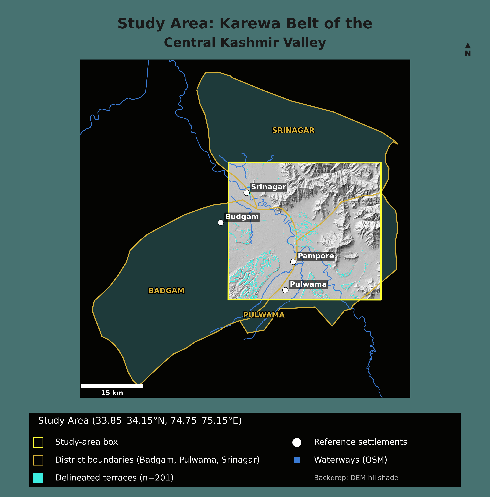

**Figure 1.** Study area overview showing the three districts (Badgam, Pulwama, Srinagar), the analytical bounding box, the 201 delineated terraces, waterways, and key settlement reference points. Backdrop: hillshade of the Copernicus DEM within the study-area box.

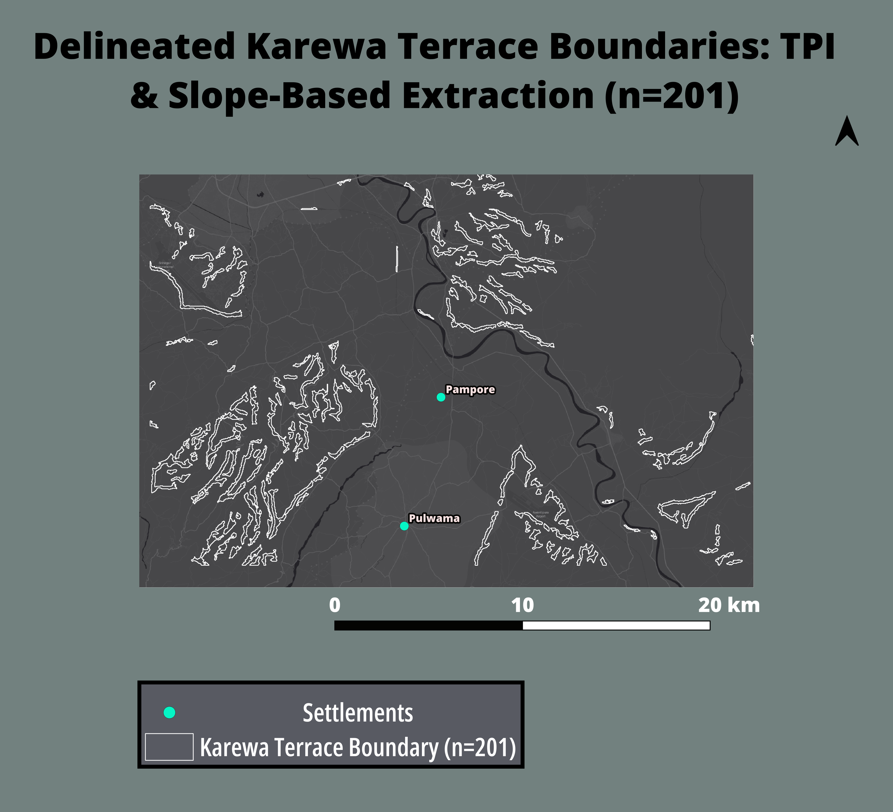

**Figure 2.** The 201 karewa terrace polygons delineated algorithmically from Topographic Position Index and slope-threshold terrain analysis.

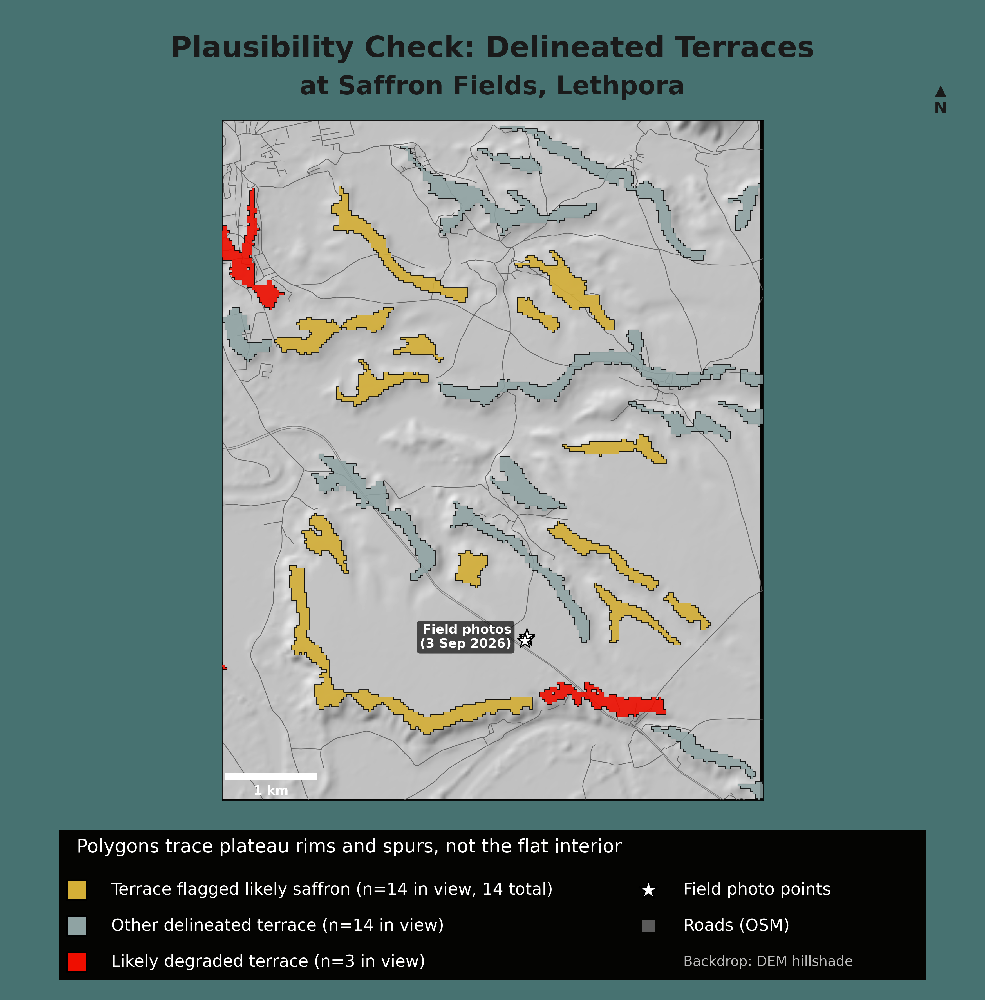

**Figure 3.** Close-range plausibility check of the delineation pipeline at the Saffron Fields, Lethpora location, over a DEM hillshade. Gold: terraces flagged likely saffron; grey: other delineated terraces; red: likely-degraded terraces; stars: the 3 September 2026 field-photo points. The polygons follow the plateau's rims and spurs; the broad flat interior, where the photos were taken, is not delineated.

### 4.2 Multi-Temporal Degradation: A Recent, Accelerating Trend

1.84% in 1994. 2.62% in 2005 (a 2001-2009 composite centred on that year, not a single-year image, per Section 6). 2.63% in 2015. A modest 0.78-point rise to 2005, then near-flat to 2015. Then 8.43% by 2025, more than triple the 2015 level. That's the unweighted mean bare-earth fraction across all 201 terraces (the area-weighted figure rises from 0.98% to 6.73%), and the shape of that curve is the whole point of this section: two comparatively flat decades, then a sharp jump. 25 of the 201 terraces, 12.4%, crossed the threshold for likely degradation over the full study period.

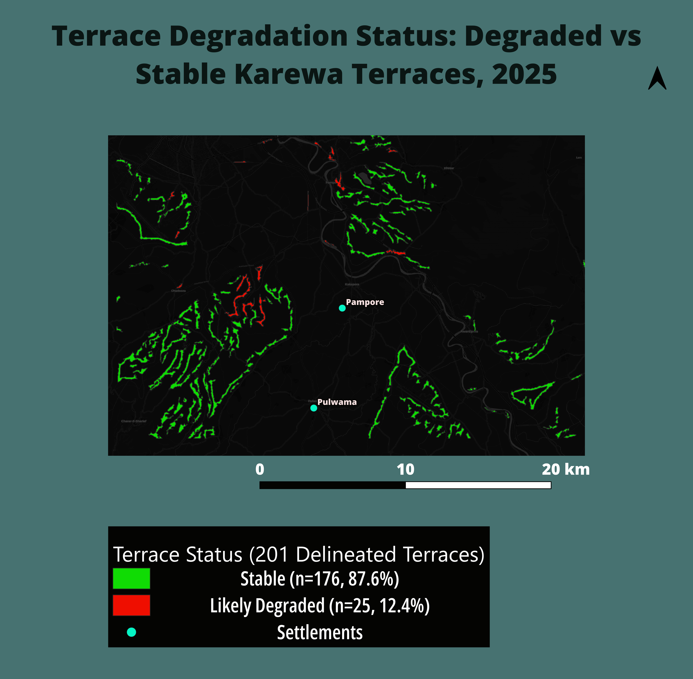

**Figure 4.** Terrace-level degradation status, 1994–2025, showing the spatial distribution of likely-degraded terraces (25 of 201) relative to stable terraces.

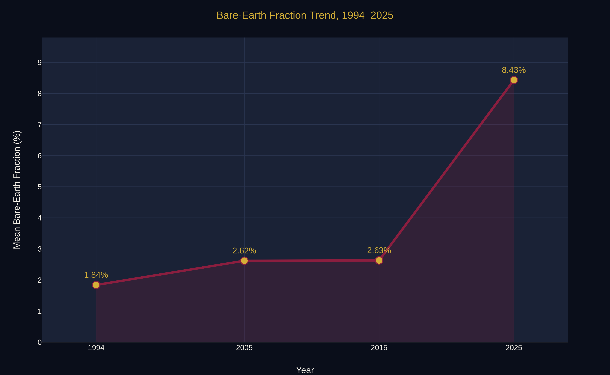

**Figure 5.** Mean bare-earth fraction across all 201 terraces at 4 time points, showing 2 decades of relative stability followed by a sharp post-2015 acceleration.

### 4.3 Absolute Area Lost and Its Concentration

Converted into absolute area, the numbers get more concrete: total bare-earth cover across all 201 terraces went from 32.2 hectares in 1994 to 222.6 hectares in 2025, a net increase of 190.3 hectares of bare-earth-classified surface, 5.8% of the total mapped terrace area. This is not a direct measure of mined area: the classifier also counts construction, tillage and erosion. But look at where that loss sits. Of the 190.3 hectares, 128.2 (67%) happened inside the 25 terraces already flagged as likely-degraded, and those 25 terraces account for only 9.7% of the total mapped area, a small corner of the study area carrying most of the loss.

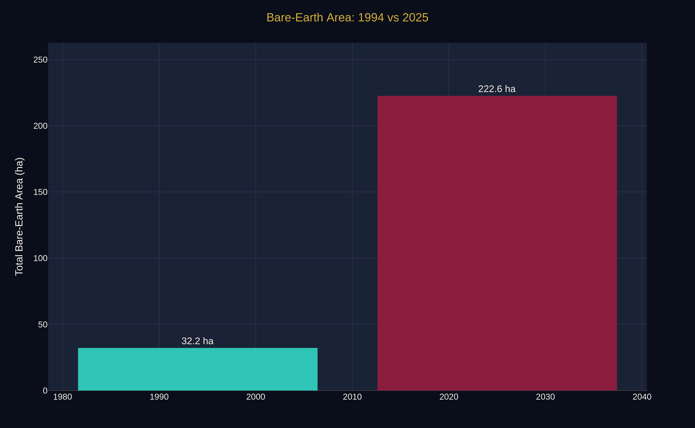

**Figure 6.** Total bare-earth area across all mapped terraces, 1994 versus 2025.

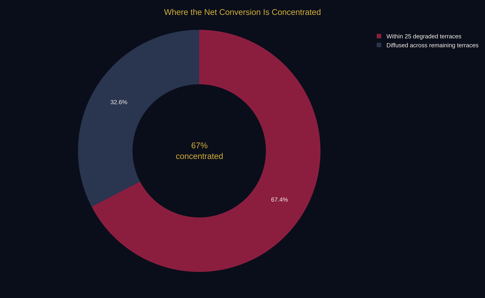

**Figure 7.** Share of total net bare-earth increase occurring within the 25 terraces flagged as likely-degraded (67%); these terraces cover 9.7% of the mapped terrace area (not shown in the chart).

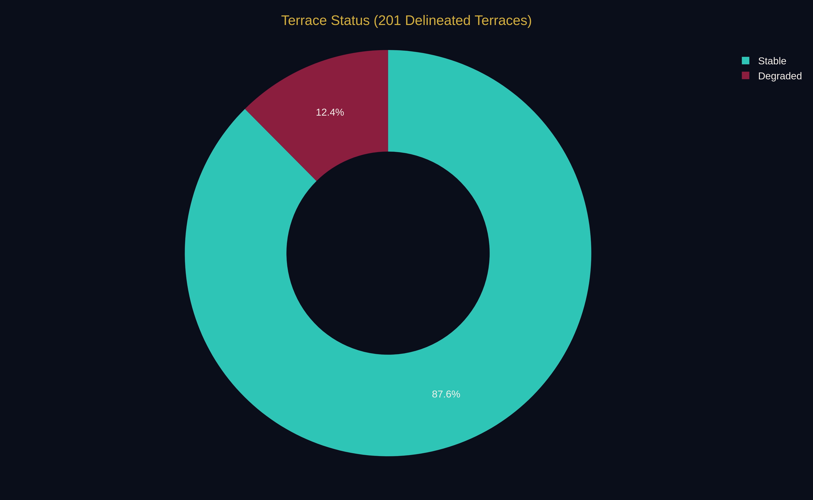

**Figure 8.** Classification split of all 201 delineated terraces into likely-degraded (25) and stable (176) categories.

### 4.4 Saffron Vulnerability and Proximity Risk

14 of 201 terraces got flagged as likely saffron-cultivating by the Saffron Index. Their full polygon area is 225.4 hectares; this is the area of terraces flagged as likely saffron, not measured planted area. It is well short of the FAO's 3,200-hectare Pampore baseline. I don't read that gap as crop-area loss. It is mainly a coverage problem: the delineation follows plateau rims and spurs and leaves out the broad flat plateau interiors where much of the saffron is grown (Section 6), and the saffron threshold then narrows recall further. The two figures also differ in scope, date and definition, so the gap is not a loss estimate.

None of the 14 saffron terraces directly overlap a degraded one, though the nearest sits just 80 m from an active degradation zone. 6 of them (43%) fall within 1 km of one. Across the 500 m to 2,500 m range the affected share is 21% at 500 m, then 29%, 43%, 71%, 86%, and 93% at 2,500 m. Because this is a cumulative share, it can only rise as the radius widens, so the shape of the curve is not itself evidence; it simply shows how the 43% figure depends on the chosen 1 km radius. "At risk" here is a proximity indicator, not an estimated probability of degradation.

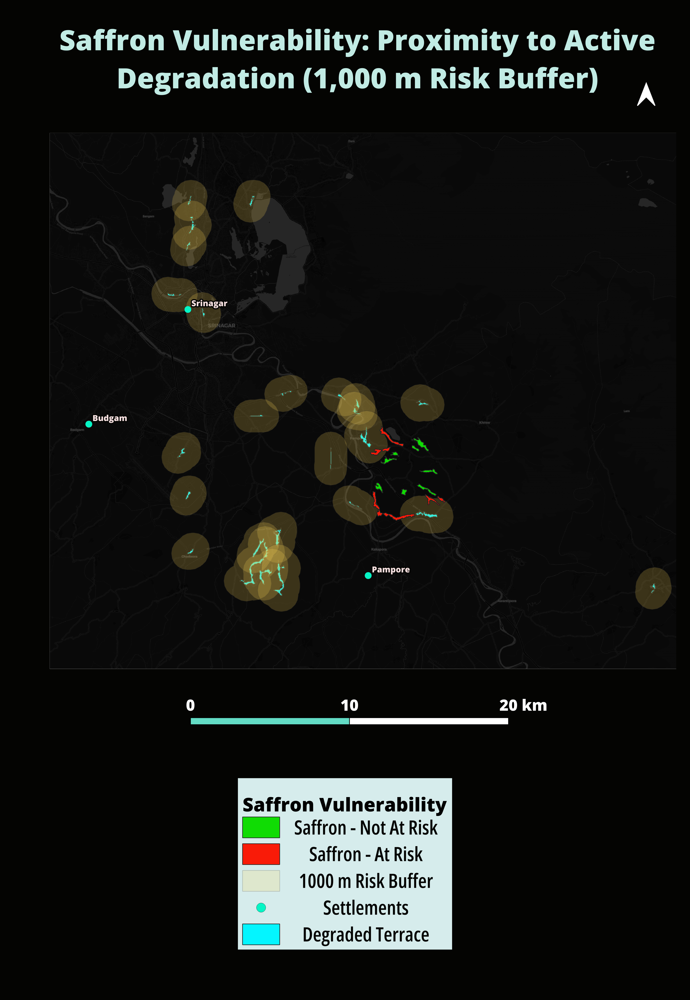

**Figure 9.** Detected saffron-cultivating terraces overlaid against proximity to the nearest degraded terrace.

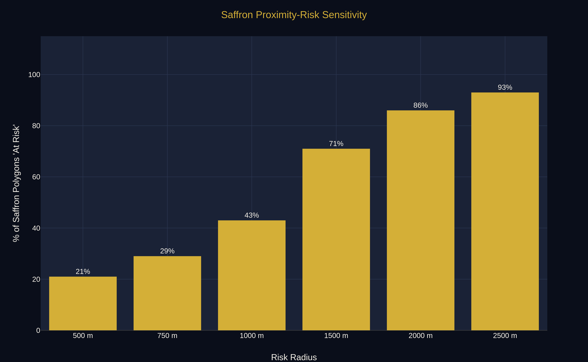

**Figure 10.** Share of saffron-cultivating terraces classified "at risk" across a range of proximity thresholds to the nearest degraded terrace, from 500 m to 2,500 m.

At official 2024-25 yield and value figures (5.27 kg/ha, an implied Rs 2.73 lakh/kg), the 225.4 ha of terraces flagged as likely saffron comes out to roughly Rs 32.4 crore in annual production value. The 6 terraces sitting inside the 1 km at-risk radius account for 123.6 ha of that, 54.8% of the flagged saffron-terrace area, worth an estimated Rs 17.8 crore annually. This number is easy to misread, so here's what it says: it's how much production value sits close to active degradation right now, not how much has already been lost. Figure 15 shows why: no saffron terrace overlaps mapped loss yet.

### 4.5 Infrastructure Association: Degradation Sits Closer to Roads and Settlements

Roads first. Degraded terraces sat a mean 75.6 m from the nearest road, median 0.0 m, meaning more than half of them are directly adjacent to or intersecting a road already. Intact terraces sat further out: mean 133.1 m, median 38.5 m. A one-sided Mann-Whitney U test confirms the difference (p = 0.0116).

Now settlements, and the pattern gets sharper. Degraded terraces sat a mean 455.9 m from the nearest of 3,266 OpenStreetMap building footprints, median 202.0 m, against 999.7 m mean (816.6 m median) for intact terraces. p = 0.0001. Rank-biserial r = 0.465, the strongest effect anywhere in this study (Section 4.9). Roads and settlements aren't the same infrastructure layer; they're correlated but distinct, so both agreeing is corroborating evidence from two related layers, not two statistically independent confirmations.

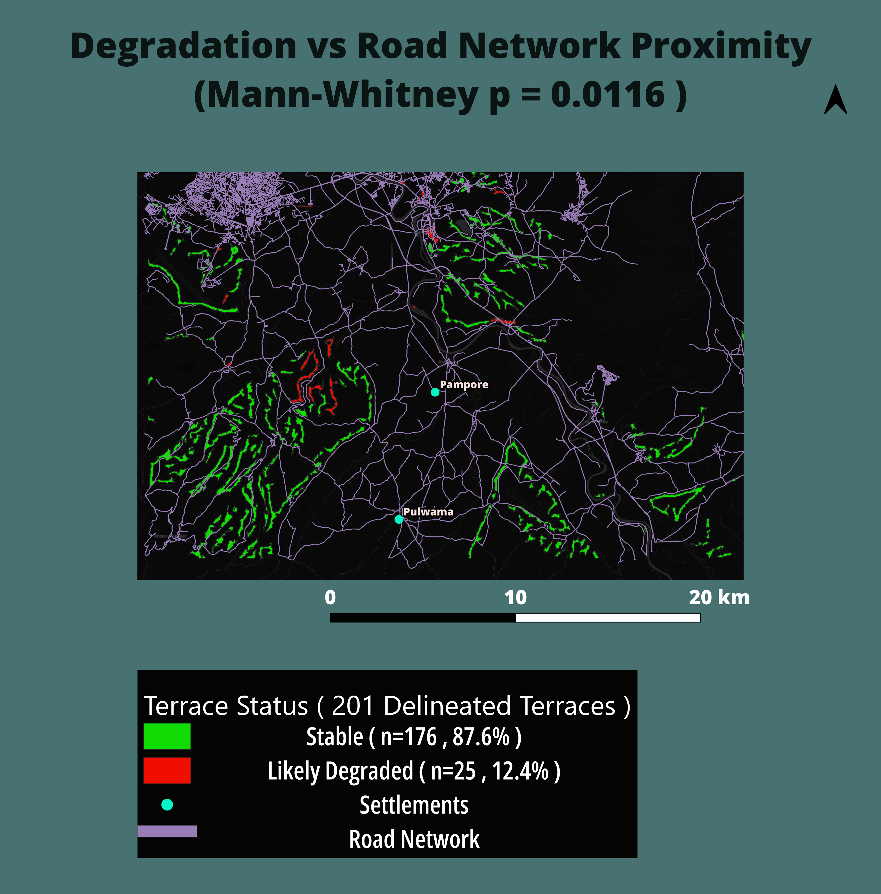

**Figure 11.** Degraded and intact terraces overlaid against the OpenStreetMap drivable road network, illustrating the closer road proximity of degraded terraces.

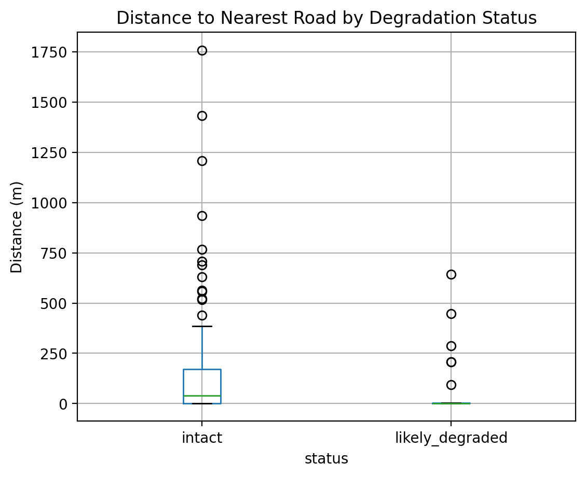

**Figure 12.** Distribution of terrace-to-nearest-road distance, compared between degraded and intact terraces (Mann-Whitney U, p = 0.0116).

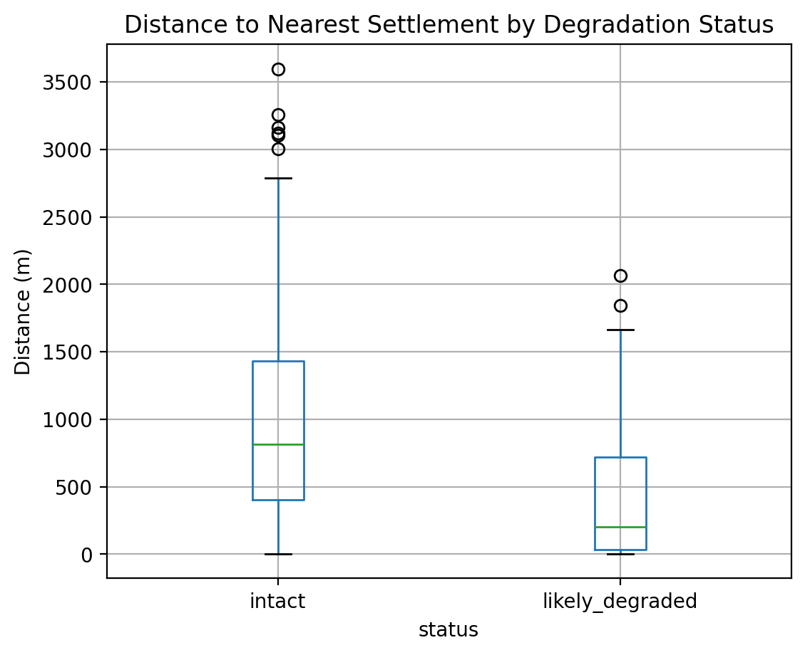

**Figure 13.** Distribution of terrace-to-nearest-building distance, compared between degraded and intact terraces (Mann-Whitney U, p = 0.0001).

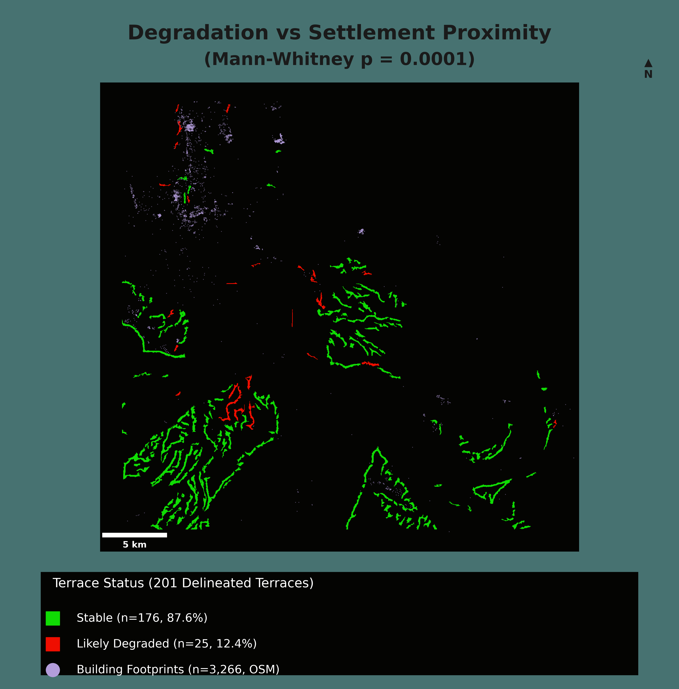

**Figure 14.** Terrace degradation status overlaid against 3,266 OpenStreetMap building footprints, the spatial counterpart to Figure 13's distance distribution.

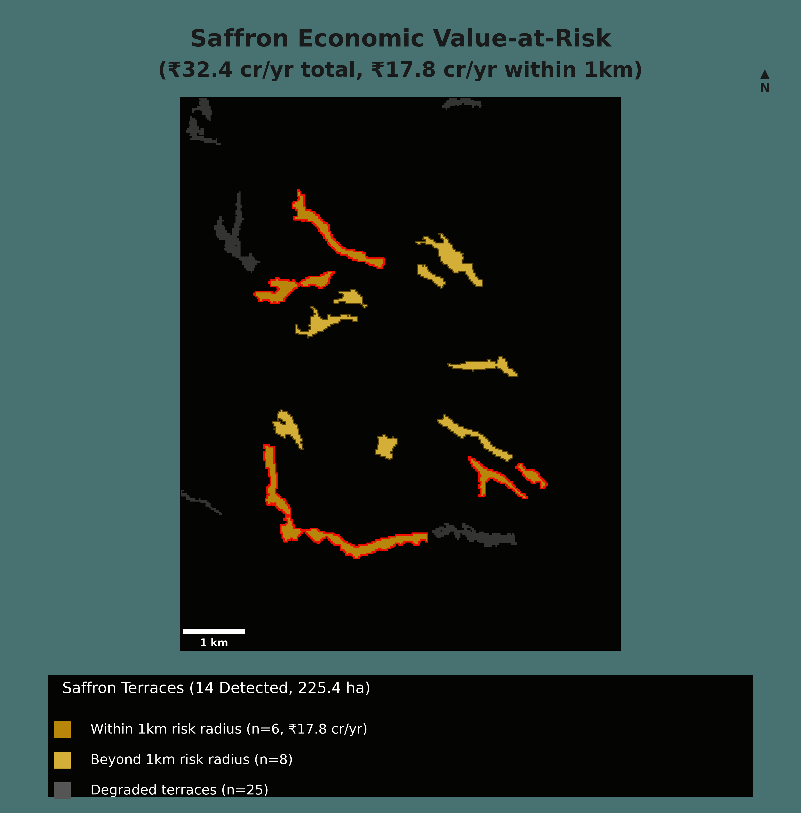

**Figure 15.** The 6 saffron terraces within the 1 km degradation-proximity radius (Rs 17.8 crore/year) against the 8 beyond it, relative to the 25 degraded terraces.

### 4.6 Geomorphometric Comparison: Compactness and Slope

The mean compactness of degraded terraces is lower than that of intact terraces (0.138 versus 0.191, p = 0.0044), so the degraded group has more irregular outlines. This should not be read as mining scars recorded in the shape: the polygons come from the Copernicus DEM, built from TanDEM-X acquisitions of 2011–2015, so most of the post-2015 bare-earth increase postdates the terrain the shapes are drawn from. Mean internal slope does not differ significantly between the 2 groups (2.89° intact, 3.06° degraded, p = 0.1711), so degradation does not appear to concentrate on steeper terrace surfaces. Compactness is a group-level difference, not an independent classifier: the 25 least-compact terraces include only 2 of the 25 degraded ones.

### 4.7 Threshold Sensitivity

Sweeping the 15-percentage-point degradation threshold doesn't shift the classification by much. Across the 12-20 point range, the flagged count stays in a stable 23-31 terraces, with 25 of them at the 15-point threshold I used. Even at the extremes I tested, 5 points and 30 points, the count only moves to 49 and 14 respectively. That's a wide swing, but not a cliff edge sitting right at 15.

The share of saffron terraces classified as near-degradation stays between 39% and 44% across the saffron-signature threshold range of 0.05 to 0.175, close to the reported 43% share at the 0.15 threshold I used. Only starts to get noisy beyond 0.175, at which point the number of terraces detected is 4-6, and any percentage based on that few is unstable by construction. Running the same check on the TPI/slope delineation grid itself, with TPI in {2,3,4} and slope in {6°,8°,10°}, the (3,8) pair I used sits centrally within the tested range, well away from either extreme, and the resulting count stays within roughly 144 to 279 candidate polygons after the area filter (the elevation filter was not applied in this sweep), with no sign that the central choice was a favourable outlier.

That doesn't constitute accuracy validation in the formal sense, since there is no separate (independently labelled) ground-truth set for this landscape. Stability under nearby thresholds shows the counts are not an artefact of one fortuitous cut-off; it does not show the classification is accurate.

### 4.8 Resolution-Mismatch Robustness Check

Resample the 2025 Sentinel-2 composite to the same resolution as Landsat, 30 m, and the mean bare-earth fraction value drops from 8.43% to 7.48%, a decrease of 0.94 percentage points. Net 1994–2025 conversion falls from 190.3 ha to 165.2 ha, and the degraded-terrace count drops from 25 to 23. Resolution matching reduces net 1994-2025 conversion by about 13%, and the 2015-2025 jump from 5.79 to 4.85 percentage points (about 16%). That is a solid, measurable impact, not one to be waved aside.

The acceleration remains. Even resolution-matched at 30 m, 2025's 7.48% is still about 2.8 times the 2015 level of 2.63%. So pixel size alone does not produce the post-2015 jump. This check does not isolate other Landsat/Sentinel-2 differences (spectral bands, processing, acquisition timing, compositing), so a sensor contribution beyond resolution cannot be ruled out.

### 4.9 Effect Sizes and Multiple-Comparison Correction

Alongside the p-values, I computed the rank-biserial correlation (r = 1 − 2U/(n1·n2), with the degraded group first, so positive r means degraded terraces rank lower), a nonparametric effect size that pairs with the Mann-Whitney U test, for all 4 comparisons: settlement proximity (r = 0.465), compactness (r = 0.352), road proximity (r = 0.268), slope (r = −0.170). Settlement proximity is the largest effect, moderate in size; compactness is moderate; road proximity is small-to-moderate; slope is small and not significant.

I applied a Holm-Bonferroni correction (family-wise α = 0.05) to 4 Mann-Whitney tests, so as to not illicitly inflate the number of false-positive results across the family. Settlement proximity (p = 0.0001, adjusted threshold 0.0125), compactness (p = 0.0044, adjusted threshold 0.0167), and road proximity (p = 0.0116, adjusted threshold 0.025) all survive it. The slope is already not significant before the correction (p = 0.1711). Holm controls for multiple testing but not for spatial dependence: the 201 terraces are neighbours in one landscape and degraded terraces cluster, so these terrace-level p-values may overstate the strength of evidence (Section 6).

## 5. Discussion

The central point here is timing and shape: this is recent, it's concentrated in space, and it keeps speeding up. That's a very different signature from slow degradation spread evenly over decades, matching directly to the pattern described in the grey, non-peer-reviewed literature reviewed in Section 2, which documents a contemporary, last-decade increase in mining pressure, not an old-standing trend. That reporting already said this was happening. This study just puts a figure next to it. The road result (p = 0.0116) and the settlement result (p = 0.0001, r = 0.465) both show that degraded terraces sit closer to both infrastructure types, consistent with the material's roadability, that is, how cheaply it moves to market where roads and labour are already present (Engert et al., 2025). But I don't want to read too much into the settlement result on its own. Yes, it's consistent with an accessibility-driven extraction model, but it's also consistent with something more fundamental: a general gradient of human activity with settlement distance that could show up just as easily through a transport-economics road-access mechanism. Both associations are correlational, and I don't have a dated road/settlement record that lets me establish which came first. That causal sequence is something for future work.

The compactness result in Section 4.6 is a group-level difference between terraces already classified by NDVI, not an independent identification of them: ranking terraces by compactness alone recovers only 2 of the 25 degraded terraces among the 25 least compact. Because the DEM predates most of the post-2015 change, it describes which terrace shapes tended to degrade, not shapes produced by the degradation.

The saffron-proximity finding is useful mainly as an early warning, not as a lagging one, since the data behind it can't support a direct-loss number. This finding is not affected by the drop-off from the FAO baseline set out in Section 6. The 14 terraces I detected are the ones that my phenological signature was able to align to with the highest confidence, and also based on a sensitivity analysis conducted in Section 4.7, the proximity-risk share doesn't change very much for a wide spectrum of detection thresholds so it's not dependent on the precise 0.15 threshold. Whether a higher-recall detection would raise or lower the 43% share is unknown; the share applies only to the 14 terraces detected here. I report value in rupees as well as hectares deliberately: hectares resonate with a geospatial audience, rupees with a district agriculture office or a legislative budget line, and I wanted this study to speak to both. I think this degradation and proximity-risk map comes close to being the kind of policy-alignment check this study can't fully deliver on its own: whether the roughly Rs 400 crore National Mission on Saffron, which has brought about 2,598 ha under rejuvenation, lines up with where the risk is highest. I've said before, I can't make that comparison right now because they don't have scheme-level spatial data that's publicly available, but if they did exist the outputs would be poised to support that comparison.

Then there is the legal gap, which is a separate issue from misaligned targeting (the RQ4 question above). As of the most recent legislative reporting I located (February 2025), no karewa-specific legislation safeguards karewa land in Jammu & Kashmir against excavation (Kashmir Observer, 2025; Greater Kashmir, 2025). A private member's bill, the J&K Karewa Protection Bill, 2025, sponsored by Dr. Syed Bashir Veeri (MLA, Bijbehara), would ban excavation of clay, sand and gravel in ecologically sensitive karewa zones, allow mining only in already-degraded areas with prior approval from a Karewa Protection Authority and the J&K State Environmental Impact Assessment Authority, and set fines of up to Rs 10 lakh per violation and up to 5 years' imprisonment for repeat offences. The bill was pending in that reporting, while the Revenue and Geology & Mining departments continued to issue the excavation and disposal permits the bill would restrict. This changes how to read the road and settlement proximity results. Extraction is not unregulated in the sense of having no permits, but there is no karewa-specific protection to enforce, so the pattern cannot be read as enforcement of such a rule falling short. The policy shift this points to is from "enforce what's already there more consistently" to "put a karewa protection regime in place at all," and this study supplies one kind of evidence such a regime would need: a terrace-level map of where bare-earth increase and proximity cluster.

## 6. Limitations

- The area of terraces flagged as likely saffron (225.4 ha) is far below the FAO GIAHS baseline (3,200 ha). I report this as a methodological limitation, not as cropland loss. The main cause is delineation coverage (next bullet), compounded by the saffron-signature threshold; the two figures also differ in scope, date and definition.
- The TPI/slope rule captures terrace rims, spurs and edges rather than the broad flat interiors of large plateaus. On a wide flat plateau, interior pixels have TPI near zero relative to a ~455 m neighbourhood and fall below the 3 m threshold. At Lethpora the delineated polygons ring the cultivated plateau but leave its interior out; the field photographs below were taken inside that interior, about 0.5 km from the nearest delineated polygon. All terrace-level results therefore describe the delineated rim and spur surfaces, not whole karewa plateaus.
- RQ4 (about governance-alignment) was not amenable to statistical testing. I searched for spatially resolved National Mission on Saffron allocation data, but could only locate data at the valley level, which did not match the level of detail in this study's map of the terrace. It is put in the too-hard basket, that is in future action, preferably undertaken in collaboration with the implementing agency of the scheme.
- The multi-temporal analysis cannot be applied prior to 1994 as there is a gap in the landsat record before that year before it will operate in an usable time frame of seasonal coverage.
- The 2025 point uses 10 m Sentinel-2 while 1994–2015 use 30 m Landsat. Section 4.8 measures the pixel-size part of this directly: about 13% of net 1994–2025 conversion (190.3 ha vs 165.2 ha) and about 16% of the 2015–2025 jump. Other sensor differences (spectral response, processing, compositing) are not tested, so the total sensor effect could be larger.
- 2005 used a wider net than intended. Since the June-September 2005 Landsat 5 query with a cloud filter returned 0 images, I widened the window to May-October, extended it to 2001-2009 (four years either side of 2005), dropped the cloud filter and used a median composite (as detailed in SS_Development_Log.md). That multi-year composite may smooth short-term change in that period; it does not affect the 1994 and 2025 endpoints or the 2015 point, but the four time slices are not equally comparable, and 2005 and 2015 use a wider seasonal window than 1994 and 2025.
- As there is no detailed dataset available at terrace level (or at Pampore-belt) and their saffron yield and price, 1 statewide yield and price (5.27kg/ha & Rs 2.73 lakh/kg) is used for each identified saffron terrace. Output per terrace is likely to be related to soil quality, rejuvenation status and micro-climate, and premium production prices of premium (GI-tagged) from Pampore are likely to exceed the statewide total applied here. This is not a precise appraisal but rather an "order of magnitude" VA estimate.
- Legal protection finding is the result of legislative reporting at the time of the study's research. A private member's bill is in flux when not continually covered, so it is advisable, after the events of this investigation, to recheck the status each time before assuming that "no karewa-specific statute" still holds.
- Because there is no ground truth data for reference use for this landscape, there is no existing formal accuracy evaluation of this data set using independently labeled ground truth points yet, nor is there a confusion matrix with producers' and user's accuracy. Instead I have validated the thresholds behind each classification here by doing the sensitivity sweep in Section 4.7 and checking their results visually. I have already developed a ground-truth class of 150 samples to this end, but these have not yet been labelled manually.
- The 201 terrace polygons themselves come from the Copernicus GLO-30 DEM (built from TanDEM-X acquisitions of 2011–2015), and that same fixed set of 201 is what the 1994-2025 NDVI history is then measured against. A terrace that had already been substantially excavated or erased before this DEM was captured simply wouldn't register as a terrace-shaped landform today, so it would never enter this 201-polygon set to begin with. That means the 190.3 ha figure is the bare-earth conversion measured within the terraces that a DEM-based algorithm can recognize as terraces in the 2011–2015 DEM, not a full historical accounting of every karewa surface that has ever existed across this belt. The same epoch issue means shape metrics such as compactness describe 2011–2015 terrain, before most of the measured change.
- The statistical tests treat the 201 terraces as independent observations. They are neighbours in one landscape, degraded terraces cluster spatially, and no spatial-autocorrelation adjustment was made, so the reported p-values may overstate the evidence.
- The settlement test uses 3,266 OpenStreetMap building footprints for an area that includes much of Srinagar, so OSM building coverage is far from complete. Distance to the nearest mapped building partly reflects where OSM contributors have mapped, not only where people live.
- As a small, separate check alongside that still-unlabelled 150-point sample, I visited the Lethpora saffron belt in person on 3 September 2026 and took 4 photographs with a GPS-stamp overlay, clustered around 33.97°N, 74.95°E, on the plateau shown in Figure 3. These points lie inside the plateau interior, outside all 201 delineated polygons (about 0.5 km from the nearest one). Saffron flowers only in a short October–November window, so what these photos show is dormant, freshly-tilled soil, not visible crop. That's what an active, pre-flowering saffron plot is supposed to look like at this time of year, not evidence that nothing is planted there. This bare, tilled appearance is not the same signal as the persistent, multi-year bare-earth increase the degradation classifier looks for, so one seasonal photo like this can't confirm or rule out degradation on its own. It's a small field anchor, not a validation exercise. I'm planning a return visit in October 2026, during peak bloom, to get a proper before/after pair at the same coordinates.

## 7. Conclusion

Within the 201 karewa terrace polygons this study delineates from the 2011–2015 Copernicus DEM, bare-earth cover has increased measurably, and quickly. By the measure placed on the decade since 2015, most of that measured loss falls there. Degraded terraces sit closer to roads and to mapped buildings, the way Section 4.5's numbers already showed. No detected saffron terrace overlaps mapped degradation yet; what sits near it is an estimated Rs 17.8 crore in annual production value, a value-at-risk figure rather than a realised loss. There is no karewa-specific legal check on excavation: as of the February 2025 reporting, the one bill that would regulate karewa excavation in Jammu & Kashmir was pending. This study does not test whether that gap causes the pattern. There are 2 implications from that, and I believe policy implications of both. 1st, any funds that are assigned to rejuvenating the saffron sector would need to be matched with the money that is being spent where it is most at risk of degradation. Don't assume that this is the same location. 2nd, the case for karewa protection now has measured evidence behind it: the bare-earth increase can be quantified, it is recent, and it sits near saffron value, with no karewa-specific law in place.

## References

De Terra, H., & Paterson, T. T. (1939). *Studies on the Ice Age in India and Associated Human Cultures.* Carnegie Institution of Washington. [Full text](https://archive.org/details/dli.pahar.2748)

Dar, R. A., & Zeeden, C. (2020). Loess-Palaeosol Sequences in the Kashmir Valley, NW Himalayas: A Review. *Frontiers in Earth Science*, 8, 113. [https://doi.org/10.3389/feart.2020.00113](https://doi.org/10.3389/feart.2020.00113)

Bhat, G. R., Bali, B. S., Balaji, S., Iqbal, V., & Balakrishna. (2016). Earthquake triggered soft sediment deformational structures (seismites) in the Karewa formations of Kashmir valley—An indicator for palaeo-seismicity. *Journal of the Geological Society of India*, 87(4), 439–452. [https://doi.org/10.1007/s12594-016-0412-y](https://doi.org/10.1007/s12594-016-0412-y)

Weiss, A. D. (2001). Topographic Position and Landforms Analysis. Poster presented at the ESRI International User Conference, San Diego, CA. [Poster PDF](https://www.jennessent.com/downloads/TPI-poster-TNC_18x22.pdf)

Boeing, G. (2017). OSMnx: New Methods for Acquiring, Constructing, Analyzing, and Visualizing Complex Street Networks. *Computers, Environment and Urban Systems*, 65, 126–139. [https://doi.org/10.1016/j.compenvurbsys.2017.05.004](https://doi.org/10.1016/j.compenvurbsys.2017.05.004)

Madasa, A., Orimoloye, I. R., & Ololade, O. O. (2021). Application of geospatial indices for mapping land cover/use change detection in a mining area. *Journal of African Earth Sciences*, 175, 104108. [https://doi.org/10.1016/j.jafrearsci.2021.104108](https://doi.org/10.1016/j.jafrearsci.2021.104108)

Holm, S. (1979). A Simple Sequentially Rejective Multiple Test Procedure. *Scandinavian Journal of Statistics*, 6(2), 65–70.

Kerby, D. S. (2014). The Simple Difference Formula: An Approach to Teaching Nonparametric Correlation. *Comprehensive Psychology*, 3, 11.IT.3.1. [https://doi.org/10.2466/11.IT.3.1](https://doi.org/10.2466/11.IT.3.1)

Mann, H. B., & Whitney, D. R. (1947). On a Test of Whether one of Two Random Variables is Stochastically Larger than the Other. *Annals of Mathematical Statistics*, 18(1), 50–60. [https://doi.org/10.1214/aoms/1177730491](https://doi.org/10.1214/aoms/1177730491)

Engert, J. E., Souza, C. M., Kleinschroth, F., Ishida, F. Y., Costa, S. P., Botelho, J., & Laurance, W. F. (2025). Road expansion risk predicts future hotspots of tropical deforestation. *Proceedings of the National Academy of Sciences*, 122(52). [https://doi.org/10.1073/pnas.2502426122](https://doi.org/10.1073/pnas.2502426122)

Rafi, A. B., & Syed, S. (2023, January 27). Nourishing soils of Kashmir's karewas crumble under infrastructure. *Mongabay India*. [Read](https://india.mongabay.com/2023/01/nourishing-soils-of-kashmirs-karewas-crumble-under-infrastructure/)

Deccan Herald. (2022, March 13). Saffron boom in Kashmir: Highest production in 25 years. [Read](https://www.deccanherald.com/india/saffron-boom-in-kashmir-highest-production-in-25-years-1090848.html)

FAO GIAHS. (2012). *Saffron Heritage Site of Kashmir in India* (Part 1). Globally Important Agricultural Heritage Systems Pilot Project, SKUAST-K. [Read](https://www.fao.org/3/bp791e/bp791e.pdf)

Press Post. (2026). Rs 400 cr PM Saffron Mission halts slide in Kashmir, 2,598 ha brought under rejuvenation. [Read](https://india.presspost.in/rs-400-cr-pm-saffron-mission-halts-slide-in-kashmir-2598-ha-brought-under-rejuvenation)

Greater Kashmir. (2026, February 18). J&K Saffron output drops to 19.58 MT in 2024-25: Govt. [Read](https://www.greaterkashmir.com/business/jk-saffron-output-drops-to-19-58-mt-in-2024-25-govt)

Kashmir Life. (2026, February 12). Kashmir's Saffron Sold for Rs 534.53 Cr in 2024-25, Govt Tells Assembly. [Read](https://kashmirlife.net/kashmirs-saffron-sold-for-rs-534-53-cr-in-2024-25-govt-tells-assembly-424949/)

Kashmir Reader. (2026, February 13). Over 90 metric tonnes of saffron produced in last five years in J&K: Govt. [Read](https://kashmirreader.com/2026/02/13/over-90-metric-tonnes-of-saffron-produced-in-last-five-years-in-jk-govt/)

Kashmir Observer. (2025, February 22). Will the Karewa Protection Bill Become a Law in J&K? [Read](https://kashmirobserver.net/2025/02/22/will-the-karewa-protection-bill-become-a-law-in-jk/)

Greater Kashmir. (2025, February 28). Why do Karewas need legal Protection in J&K? [Read](https://www.greaterkashmir.com/opinion/why-do-karewas-need-legal-protection-in-jk/)
